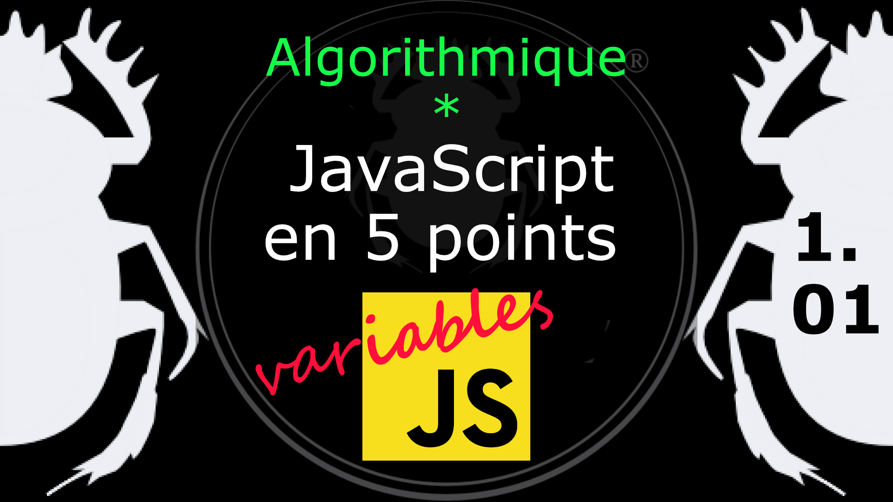

Fiche Web Design

JavaScript en 5 points
1.  Variables
2.  Conditions
3.  Boucles
4.  Tableaux
5.  Fonctions

Technologies en jeux : JavaScript

Vous avez juste besoin d’une navigateur et de sa console web.

# JavaScript en cinq points
## 1.01 Qu'est ce qu'une variable ?

Les variables sont des noms symboliques désignant une valeur utilisées dans l'application. Ce nom de variable est appelé identifiant ; il doit respecter certaines règles :

*   Un identifiant (variable) doit toujours commencer par une lettre, un tiret bas (_) ou un dollar ($), **jamais par un chiffre (0 à 9)** même s'il peut en contenir. Voir les conventions de nommages en JS. 
*   JavaScript est sensible à la casse, il fait donc une différence entre les majuscules (A - Z) et les minuscules (a - z). 

* Wikipédia, variable : [https://fr.wikipedia.org/wiki/Variable_(informatique) ](https://fr.wikipedia.org/wiki/Variable_(informatique))
*  MDN, Les bases du langage : [ https://developer.mozilla.org/fr/docs/Web/JavaScript/Guide/Types_et_grammaire#D
%C3%A9clarations]( https://developer.mozilla.org/fr/docs/Web/JavaScript/Guide/Types_et_grammaire#D%C3%A9clarations)