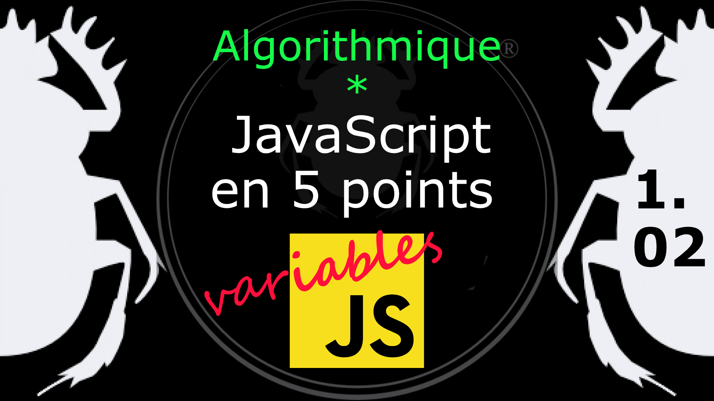

Fiche Web Design

JavaScript en 5 points
1.  Variables
2.  Conditions
3.  Boucles
4.  Tableaux
5.  Fonctions

Technologies en jeux : JavaScript

Vous avez juste besoin d’une navigateur et de sa console web.

# JavaScript en cinq points
## 1.02 Déclaration d'une variable

Il existe 3 façons de déclarer une variable :
* **var**
    * déclaration de variable (globale ou locale) et éventuellement de sa valeur. 
* **let**
    * déclaration d'une variable dont la portée est celle du bloc courant. 
* **const**
    * déclaration d'une constante dont la portée est celle du bloc courant mais qui reste accessible en lecture seule, sa valeur ne sera pas modifiable. 

            var maVariable; // Camel Case
            var MaVariable; // Pascal Case
            var _maVariable; // Camel Case
            var ma_variable; // Snake Case

Déclarer plusieurs variables en les séparant par des virgules. 

    var x, y, z;

*   MDN, var : [https://developer.mozilla.org/fr/docs/Web/JavaScript/Reference/Instructions/var](https://developer.mozilla.org/fr/docs/Web/JavaScript/Reference/Instructions/var)
*   MDN, let : [https://developer.mozilla.org/fr/docs/Web/JavaScript/Reference/Instructions/let](https://developer.mozilla.org/fr/docs/Web/JavaScript/Reference/Instructions/let)
*   MDN, const : [https://developer.mozilla.org/fr/docs/Web/JavaScript/Reference/Instructions/const](https://developer.mozilla.org/fr/docs/Web/JavaScript/Reference/Instructions/const)
