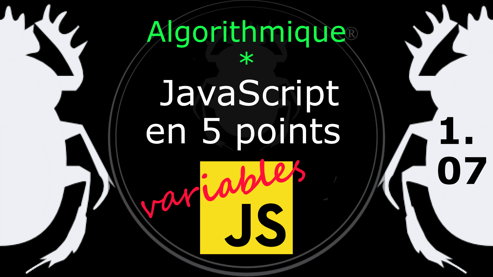

Fiche Web Design

JavaScript en 5 points
1.  Variables
2.  Conditions
3.  Boucles
4.  Tableaux
5.  Fonctions

Technologies en jeux : JavaScript

Vous avez juste besoin d’une navigateur et de sa console web.

# JavaScript en cinq points
## 1.07 Remontée de fonction

Quel rapport entre les variables et les functions lors de la remontée pratiqué dans l'exécution de JavaScript ?

Quand vous écrivez ceci 
 
    panier();
    var panier = function() {
    console.log('booh');
    }

c'est équivalent de cela

    var panier;
    panier();
    panier = function() {
    console.log('booh');
    }

Dans les deux cas vous obtenez **TypeError : panier is not a function**

Si vous faites le test en console videz la entre les deux tests, sinon panier est déjà déclaré, ou bien changer le nom de la variable en
*caddy* par exemple.

On obtient une erreur parce que la variable panier est indéfinie (valeur par défaut : *undefined*) à l'appel de la fonction *panier()* ce qui provoque l'erreur* TypeError : panier is not a function.* 

Changeons de tactique sur la façon d'écrire la fonction.

Quand vous écrivez ceci 

    panier();
    function panier() {
    console.log('booh');
    }

c'est équivalent de cela

    function panier() {
    console.log('booh');
    } 
    panier();

Dans les deux cas ça fonctionne.

Si vous faites le test en console videz la entre les deux tests, sinon panier est déjà déclaré, ou bien changer le nom de la variable en
caddy par exemple.

Dans ce cas il s'agit d'une remontée de fonction en haut de son block d'instruction. Ce thème est développé dans
la partie concernant les fonctions en JavaScript. 

*   MDN, Remontée de fonctions : [https://developer.mozilla.org/fr/docs/Web/JavaScript/Guide/Types_et_grammaire#Remont%C3%A9e_de_fonctions](https://developer.mozilla.org/fr/docs/Web/JavaScript/Guide/Types_et_grammaire#Remont%C3%A9e_de_fonctions)

