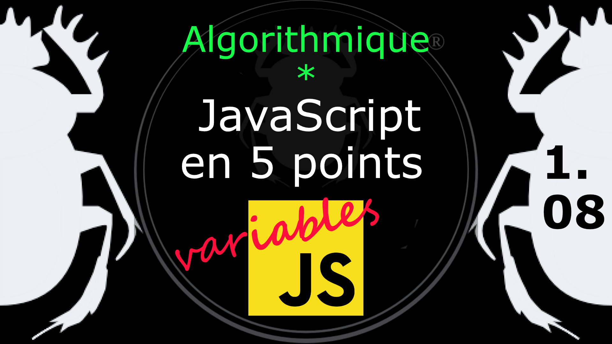

Fiche Web Design

JavaScript en 5 points
1.  Variables
2.  Conditions
3.  Boucles
4.  Tableaux
5.  Fonctions

Technologies en jeux : JavaScript

Vous avez juste besoin d’une navigateur et de sa console web.

# JavaScript en cinq points
## 1.08 Constante

Une constante, en théorie, est une sorte de variable accessible en lecture seule, c'est-à-dire ne pouvant changer de valeur, d'où sa constance. Elles sont généralement déclarées avec le nom **const** et en *Screaming Snake* 
Case. La portée d'une constante est la même que pour une variable déclarée avec var. La bonne pratique veut que l'on ne déclare pas une constante avec un nom déjà utilisé pour une variable. 

    const EURO_CURRENCY = 6.55957;

Attention toutefois, les objets déclarés en constante peuvent être modifiés sans alerte (MDN). 

*   MDN, Constantes : [https://developer.mozilla.org/fr/docs/Web/JavaScript/Guide/Types_et_grammaire#Constantes](https://developer.mozilla.org/fr/docs/Web/JavaScript/Guide/Types_et_grammaire#Constantes)
