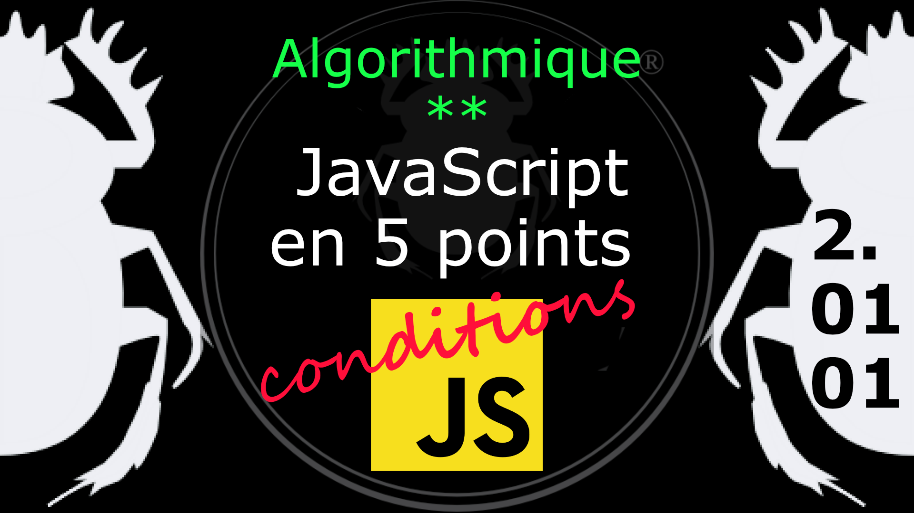

Fiche Web Design

JavaScript en 5 points
1.  Variables
2.  Conditions
3.  Boucles
4.  Tableaux
5.  Fonctions

Technologies en jeux : JavaScript

Vous avez juste besoin d’une navigateur et de sa console web.

# JavaScript en cinq points
## 2. Conditions
### 2.01.01 Rappel des opérateurs de comparaison

Pour tester des variables on a souvent besoin d'opérateur de comparaison pour construire une condition. 

    +-----------+---------------------------------------+
    | opérateur |             description               |
    +-----------+---------------------------------------+
    |  a == b   | a égale b                             |
    |  a === b  | a égale b et b est de même type que b |
    |  a >= b   | a supérieur ou égal à b               |
    |  a > b    | a strictement supérieur à b           |
    |  a <= b   | a inférieur ou égal à b               |
    |  a < b    | a strictement inférieur à b           |
    +-----------+---------------------------------------+

Ne confondez pas avec a = b où b est affecté à a, ce n'est pas une égalité. 

Même chose avec les opérateur booléens

    +-----------+----------------+----------+
    | opérateur |     usage      | résultat |
    +-----------+----------------+----------+
    |    ET     |  true && true  |  true    |
    |           |  true && false |  false   |
    |           | false && true  |  false   |
    |           | false && false |  false   |
    +-----------+----------------+----------+
    |    OU     |  true || true  |  true    |
    |           |  true || false |  true    |
    |           | false || true  |  true    |
    |           | false || false |  false   |
    +-----------+----------------+----------+
    |    NON    |     !true      |  false   |
    |           |    !false      |  true    |
    +-----------+----------------+----------+

