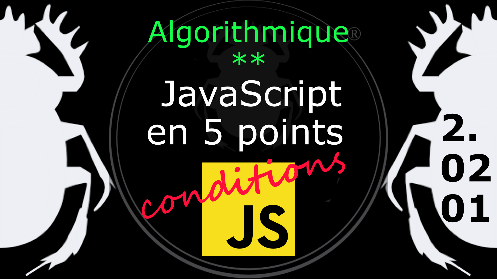

Fiche Web Design

JavaScript en 5 points
1.  Variables
2.  Conditions
3.  Boucles
4.  Tableaux
5.  Fonctions

Technologies en jeux : JavaScript

Vous avez juste besoin d’une navigateur et de sa console web.

# JavaScript en cinq points
## 2. Conditions
### 2.02.01 L'instruction if

L'instruction if (si) spécifie si un bloc de code est vrai ou faux (true / false). 

Si la condition est vrai le bloc de code est exécuté.

    if (condition) {  
		/* le bloc de code est exécuté si la condition est vraie */
	}

Exemple : 

    var heure = new Date().getHours(); 
    var salutation;

    if (heure < 12 ) {
            salutation = "Bonjour";
    }
    console.log( salutation );

L'inconvénient est que si la condition est fausse rien ne se passe. Dans ce cas il faut ajouter une échappatoire avec l'instruction else (alors).

#
Référence

MDN : [if...else](https://developer.mozilla.org/fr/docs/Web/JavaScript/Reference/Statements/if...else)