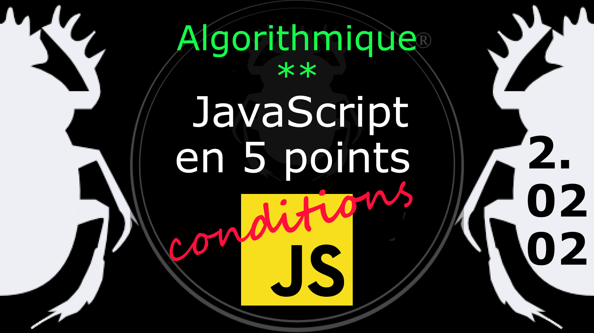

Fiche Web Design

JavaScript en 5 points
1.  Variables
2.  Conditions
3.  Boucles
4.  Tableaux
5.  Fonctions

Technologies en jeux : JavaScript

Vous avez juste besoin d’une navigateur et de sa console web.

# JavaScript en cinq points
## 2. Conditions
### 2.02.02 L'instruction else (alors)

L'instruction else est exécuté si la condition est évalué à false (faux).

    if ( condition ) {  
            /* le bloc de code est exécuté 
               si la condition est true (vrai) */
        } else {
            /* mais si la condition est évalué à false (faux) 
               c'est ce bloc de code qui s'exécute */
    }

Exemple

    var heure = new Date().getHours(); 
	var salutation;

	if (heure < 12 ) {
		salutation = "Bonjour";
	} else {
		salutation = "Bonne journée";
	}
	console.log(salutation);    

On reprend l'exemople de *if* en le complétant d'une instruction *else* pour le cas *false* (faux), voir le [diagramme](../images/diagram/diagram-si-2.png).

