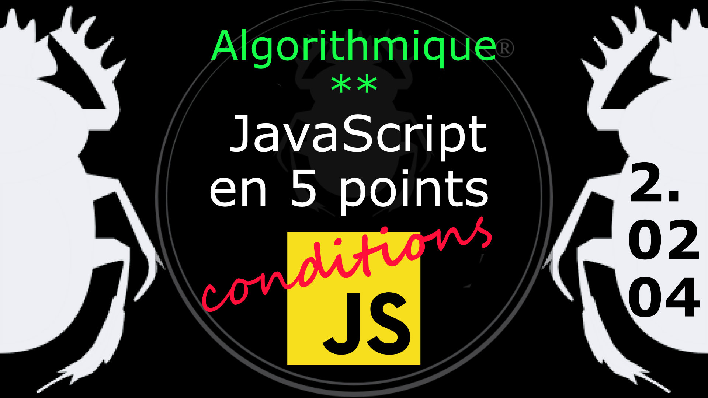

Fiche Web Design

JavaScript en 5 points
1.  Variables
2.  Conditions
3.  Boucles
4.  Tableaux
5.  Fonctions

Technologies en jeux : JavaScript

Vous avez juste besoin d’une navigateur et de sa console web.

# JavaScript en cinq points
## 2. Conditions
### 2.02.04 L'instruction *else if*

L'instruction *else if* (sinon) permet d'ajouter des conditions supplémentaires. 

On notera que l'instruction *elseif* (PHP) n'existe pas en JavaScript, pas plus que *elif* (Python). 

	if ( condition-1 ) {  
		/* le bloc de code est exécuté si la condition est true (vrai) */
	} else if ( condition-2 ) {
		/* Si la condition-1 a été évalué à false, cette nouvelle condition est testé */
		/* Si la condition-2 est évalué à true (vrai), le code est exécuté */
	} else {
		/* Si les conditions 1 et 2 ont été évalués à false (faux) c'est ce bloc de code qui s'exécute */
 	}

Exemple

	var heure = new Date().getHours(); 
	var salutation;

	if ( heure < 12 ) {
		salutation = "Bonjour";
	} else if ( heure > 19 ) {
		salutation = "Bonne soirée";
	} else {
		salutation = "Bonne journée";
	}
	console.log(salutation);

Observez le [diagramme](../images/diagram/diagram-elseif-1.png), il faut que les conditions soient fausses pour qu'elles s'enchaînent.

Cela permet souvent de simplifier une écriture de conditions imbriquées.