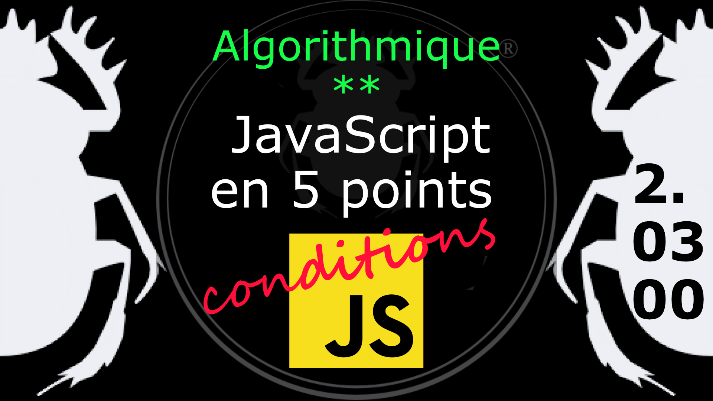

Fiche Web Design

JavaScript en 5 points
1.  Variables
2.  Conditions
3.  Boucles
4.  Tableaux
5.  Fonctions

Technologies en jeux : JavaScript

Vous avez juste besoin d’une navigateur et de sa console web.

# JavaScript en cinq points
## 2. Conditions
### 2.03.00 Le commutateur *switch*

L'instruction switch évalue une expression selon plusieurs cas, et selon le résultat obtenu exécute le code correspondant. 

	switch ( expression ) {
	case valeur-1: /* si l'expression correspond à la valeur-1, le code est exécuté */
		instruction-1
		break;
	case valeur-2: /* si l'expression correspond à la valeur-2, le code est exécuté */
		instruction-2
		break;
	case valeur-3: /* si l'expression correspond à la valeur-3, le code est exécuté */
		instruction-3
		break;
	default: /* si l'expression ne correspond à aucune valeur, le code par defaut est exécuté */
		instruction-par-defaut;
	}

Exemple

	var jour, noJour;
	noJour = new Date().getDay();

	switch ( noJour ) {
		case 0: jour = "Dimanche"; break;
		case 1: jour = "Lundi"; break;
		case 2: jour = "Mardi"; break;
		case 3: jour = "Mercredi"; break;
		case 4: jour = "Jeudi"; break;
		case 5: jour = "Vendredi"; break;
		case 6: jour = "Samedi"; break;
		
		default: jour = "Inconnu";
	}
	console.log( jour );

Le [diagramme](Diagram-switch-1-corr.png) de switch.

### Comment gérer les cas similaires ?

En retirant les instructions *break* en fin de ligne.

	/* Fruit ou légume ? */
	var reponse;
	var ingredient = "tomate";
	switch ( ingredient ) {
		case "cerise":
		case "pomme":
		case "tomate": 
		case "poire": reponse = "Ceci est un fruit."; break;
		case "patate":
		case "haricot":
		case "choux-fleur":
		case "carotte": reponse = "Ceci est un légume."; break;
		default: reponse = "inconnu"; 
	}
	console.log( reponse );

On peut grouper les valeurs a tester de cette façon car on ne peut pas utiliser les opérateurs de comparaison juste vérifier l'égalité de l'expression à une valeur. 

#
Référence

MDN : Référence JavaScript > [switch](https://developer.mozilla.org/fr/docs/Web/JavaScript/Reference/Statements/switch)