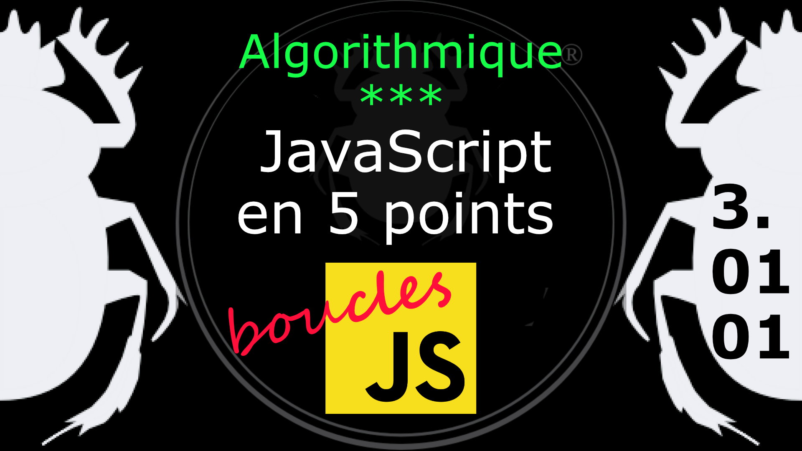

Fiche Web Design

JavaScript en 5 points
1.  Variables
2.  Conditions
3.  Boucles
4.  Tableaux
5.  Fonctions

Technologies en jeux : JavaScript

Vous avez juste besoin d’une navigateur et de sa console web.

# JavaScript en cinq points
## 3. Boucles

Une **boucle** est une structure qui permet de répéter les mêmes instructions plusieurs fois (en langage de programmation : **itérer**). 

### 3.01.01 La boucle *while* (tant que)

La boucle **TANT QUE** (while) peut être utilisé quand on ne connait pas le nombre d'itération à l'avance. Les variables utilisé dans la boucle doivent être initialisées avant. Et le plus important on doit s'assurer que la boucle se termine (voir chapitre suivant). 

Exemple
    var compteur = 0;

    while ( compteur < 10 ) {
        console.log( 'valeur de compteur = ' + compteur );
        compteur++;
    }

Diagramme [tant que](../images/diagram/loop-while-1.png).
#
Référence

MDN : Référence JavaScript > [Les boucles dans le code](https://developer.mozilla.org/fr/docs/Learn/JavaScript/Building_blocks/Looping_code)

MDN : Référence JavaScript > [while](https://developer.mozilla.org/fr/docs/Web/JavaScript/Reference/Statements/while)