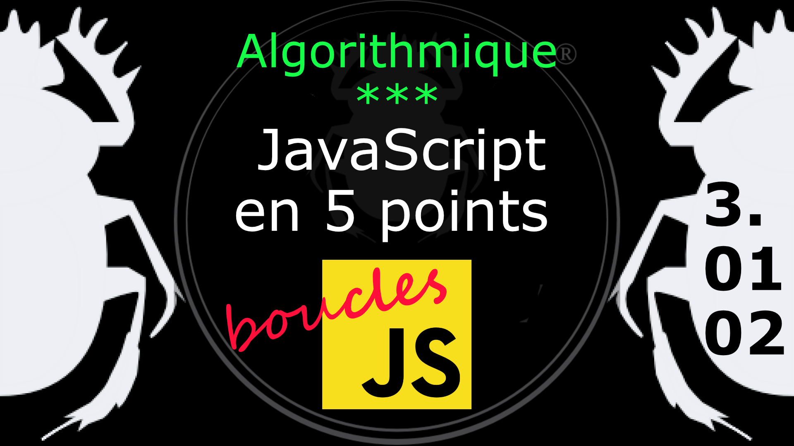

Fiche Web Design

JavaScript en 5 points
1.  Variables
2.  Conditions
3.  Boucles
4.  Tableaux
5.  Fonctions

Technologies en jeux : JavaScript

Vous avez juste besoin d’une navigateur et de sa console web.

# JavaScript en cinq points
## 3. Boucles
### 3.01.02 Boucle infinie et incrémentation

Il est important de bien comprendre à quoi sert l'incrémentation dans une boucle **While** (tant que) sinon on s'expose à des désagréments infinis. :-D

////////////////////////////////////////////////////// 

ATTENTION avant de tester le code qui suit, ça peut PLANTER votre machine, ou tout au moins votre navigateur.

//////////////////////////////////////////////////////

    var compteur = 0;

    while ( compteur < 10 ) {
        console.log( 'valeur de compteur = ' + compteur );

        /* l'incrémentation ne se fait pas */
        /* l'itération sera sans fin */
        /* ATTENTION BOUCLE INFINIE */

    }

#### Incrémentation

L'incrélmmentation classi, positive, qui ajoute +1 à chaque tour de boucle.

    // ces deux expressions sont équivalentes.
    mavar++
    mavar = mavar +1

#### Décrémentation

Si on peut ajouter 1, on peut retirer 1.

    // ces deux expressions sont équivalentes.
    mavar--
    mavar = mavar -1

#### Incrémentation sur mesure

On peut créer sont incrémentation su mesure ; ici de 3 en 3.

    mavar = mavar +3

