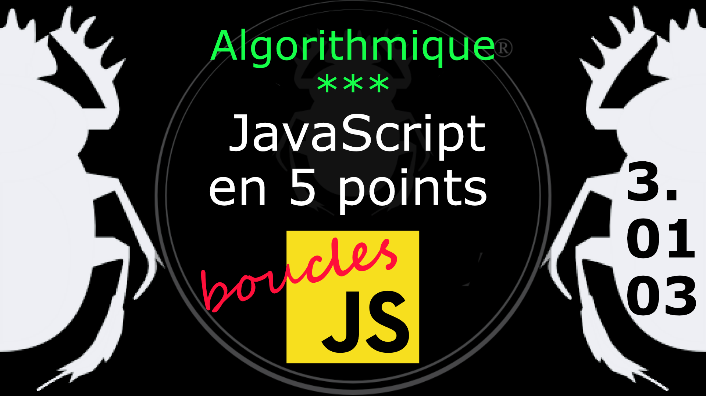

Fiche Web Design

JavaScript en 5 points
1.  Variables
2.  Conditions
3.  Boucles
4.  Tableaux
5.  Fonctions

Technologies en jeux : JavaScript

Vous avez juste besoin d’une navigateur et de sa console web.

# JavaScript en cinq points
## 3. Boucles
### 3.01.03 Interrompre une boucle (break)

L'instruction **break** (casse) permet de stopper l'exécution d'une boucle suivant les conditions. 

Exemple

    var compteur = 0;

    while ( compteur < 10 ) {
    
        if( compteur == 7 ){
            break;
        }
        console.log( 'valeur de compteur = ' + compteur );
        compteur++;
    }

Quand la valeur de la condition atteindra la valeur de 7, la boucle sera interrompue. 

Le [diagramme](../images/diagram/loop-while-2.png) de l'interruption de la boucle *while* (tant que).