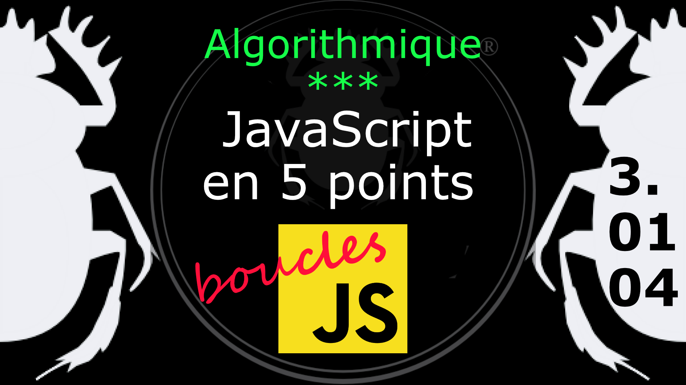

Fiche Web Design

JavaScript en 5 points
1.  Variables
2.  Conditions
3.  Boucles
4.  Tableaux
5.  Fonctions

Technologies en jeux : JavaScript

Vous avez juste besoin d’une navigateur et de sa console web.

# JavaScript en cinq points
## 3. Boucles
### 3.01.04 Do while (faire tant que)

La boucle **While** ne s'exécute que si la condition est vrai, donc si elle est fausse elle ne s'exécutera pas. 

Avec **Do while** on peut exécuter des instructions avant chaque itération de la boucle.

Exemple

    var texte = "--> ";
    var compteur = 10;
    do {
        console.log( texte  + compteur );
        compteur--;
    }
    while( compteur >= 0 );

Le [diagramme](../images/diagram/loop-dowhile-1.png) do while.

ici on voit s'afficher une sorte de compte à rebour avant l'exécution de la condition.
#
Référence

MDN : Référence JavaScript > [do...while](https://developer.mozilla.org/fr/docs/Web/JavaScript/Reference/Statements/do...while)