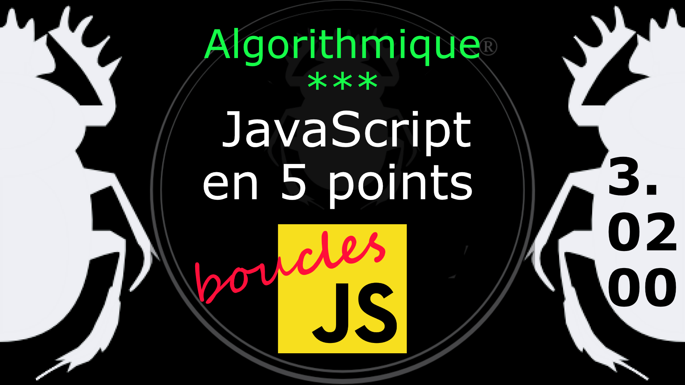
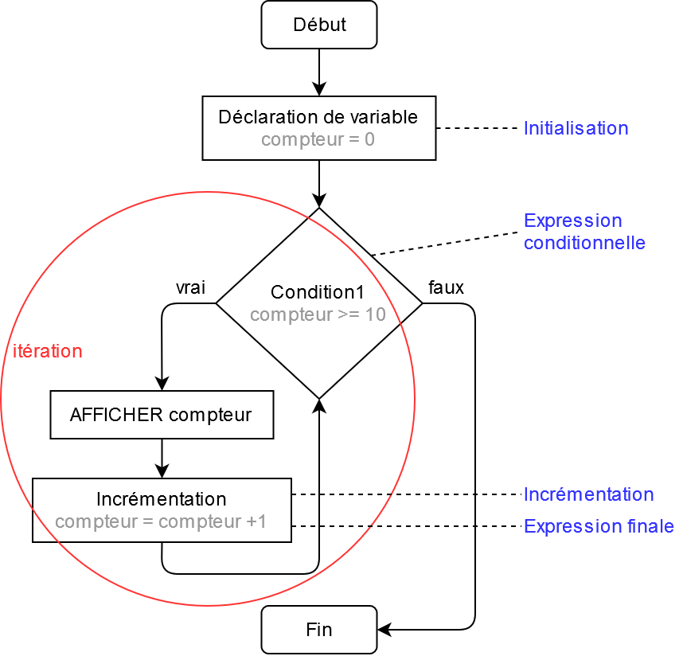

Fiche Web Design

JavaScript en 5 points
1.  Variables
2.  Conditions
3.  Boucles
4.  Tableaux
5.  Fonctions

Technologies en jeux : JavaScript

Vous avez juste besoin d’une navigateur et de sa console web.

# JavaScript en cinq points
## 3. Boucles

La boucle **POUR** (for) est une structure de contrôle de programmation qui permet de répéter l'exécution d'une séquence d'instruction.

Vocabulaire
- initialisation : 
    - Une expression ou une déclaration de variable qui est évaluée avant que la boucle démarre. On utilise généralement une variable qui agit comme un compteur.  
- test ou expression conditionnelle : 
    - Une expression conditionnelle est une fonction du langage de programmation qui effectue des calculs en fonction de l'évaluation d'une condition booléenne, à savoir vrai ou faux. On dit dans le langage courant faire un test. 
- condition : 
    - Une expression qui est évaluée avant chaque itération de la boucle. Si l'expression est vérifiée l'instruction est exécuté. 
- condition de sortie : 
    - C'est le critère grâce auquel la boucle s'arrête. Généralement une valeur que doit atteindre le compteur.
- itérer : 
    - Répéter plusieurs fois la même action.  
- incrémenter : 
    - Augmenter d'une quantité déterminée une variable à chaque boucle d'un programme.
- compteur : 
    - Un compteur permet de compter le nombre de tour d'une boucle. Il est généralement composé d'une valeur de référence à laquelle on ajoute un valeur à chaque tour de boucle. En langage de programmation on dira incrémenter une valeur.  
- expression finale : 
    - Une expression vérifiée à la fin de chaque itération, généralement utilisé pour incrémenter le compteur (qu'est la variable d'initialisation). 

### 3.02.00 La boucle *for* (pour)

 La boucle For (pour) à deux parties :

- une **entête** qui spécifie la manière de faire l'itération (compteur, condition [test], incrémentation)
- un **corps** qui est exécuté à chaque itération.

Exemple

    for( compteur = 0; compteur < 10; compteur++) {
        console.log( compteur );
    } 
[Diagramme](../images/diagram/loop-for-1.png) de la boucle *for*.

La boucle **POUR** (*for*) à ceci de pratique qu'elle intégre la déclaration de *variable* servant d'initialisation au *compteur*, ainsi que la condition et l'*incrémentation*. Elle est donc très compacte pour dérouler des tableaux par exemple (comme on va le voir plus loin). 

#
Référence

MDN : Référence JavaScript > [for](https://developer.mozilla.org/fr/docs/Web/JavaScript/Reference/Statements/for)
