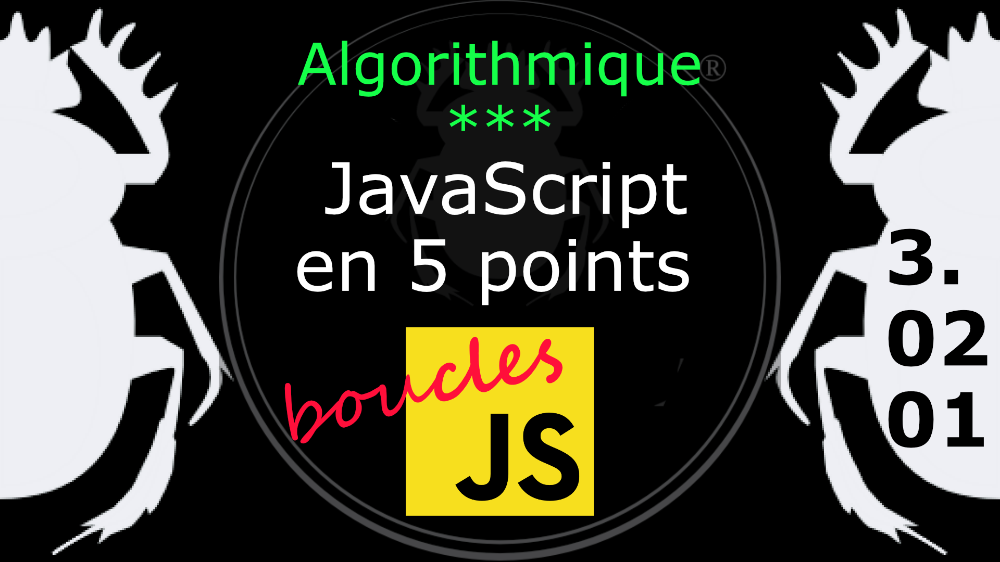

Fiche Web Design

JavaScript en 5 points
1.  Variables
2.  Conditions
3.  Boucles
4.  Tableaux
5.  Fonctions

Technologies en jeux : JavaScript

Vous avez juste besoin d’une navigateur et de sa console web.

# JavaScript en cinq points
## 3. Boucles
### 3.02.01 Interrompre une boucle *for* (break)

L'instruction break permet de terminer une boucle en cours d'instruction.

    for( compteur = 0; compteur < 10; compteur++ ) {
        if( compteur == 7 ){
            break;
        } else {
            console.log( compteur );
        }
    }    

SI la valeur de la variable compteur est égale à sept (7) on STOPPE la boucle. Autrement dit, si la condition est vrai on stoppe la boucle.

#
Référence

MDN : Référence JavaScript > [break](https://developer.mozilla.org/fr/docs/Web/JavaScript/Reference/Statements/break)