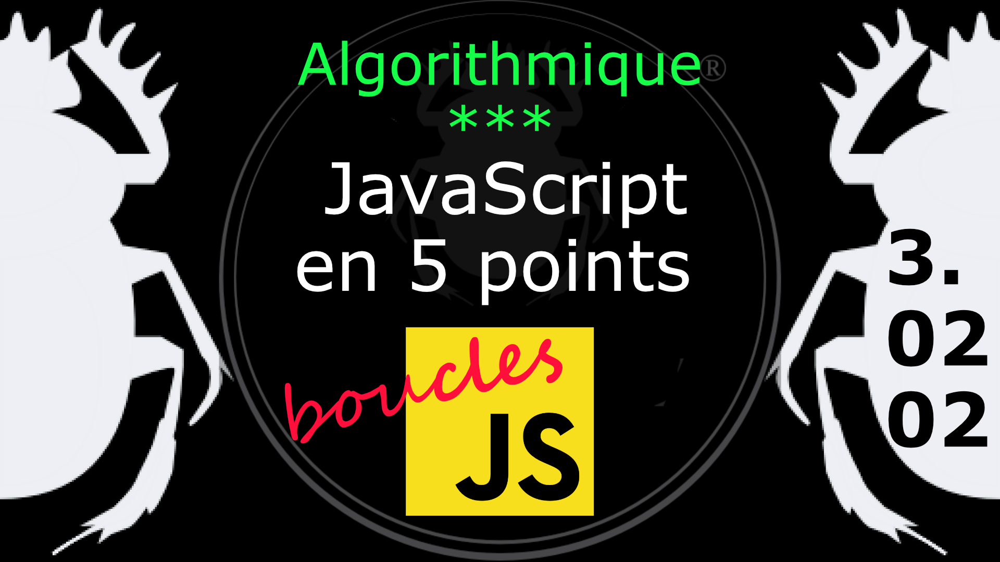

Fiche Web Design

JavaScript en 5 points
1.  Variables
2.  Conditions
3.  Boucles
4.  Tableaux
5.  Fonctions

Technologies en jeux : JavaScript

Vous avez juste besoin d’une navigateur et de sa console web.

# JavaScript en cinq points
## 3. Boucles
### 3.02.02 Continuer une boucle, nommez une boucle

L'instruction **continue** arrête l'exécution des instructions pour l'itération de la boucle courante, en bref on saute une boucle. 

    for( compteur = 0; compteur < 10; compteur++ ) {
        if( compteur == 7 ){
            continue;
        } else {
            console.log( compteur );
        }
    }    

On peut aussi reprendre cet exemple et lui donner un nom

    boucle1:
    for( compteur = 0; compteur < 10; compteur++ ) {
        if( compteur == 7 ){
            continue boucle1;
        } else {
            console.log( compteur );
        }
    }    

On pourra faire référence à ce bloc de code directement en appelant son nom **boucle1**. 

#
Référence

MDN : Référence JavaScript > [continue](https://developer.mozilla.org/fr/docs/Web/JavaScript/Reference/Statements/continue)

MDN : Référence JavaScript > [label](https://developer.mozilla.org/fr/docs/Web/JavaScript/Reference/Statements/label)

Pour aller plus loin on peut consulter "boucles et itérations" sur le site de *Mozilla developer*. On abordera cette partie plus loin après avoir vu les tableaux et les objets. Il y a aussi l'excellent article sur *Zen Dev* à propos des différentes boucles dans JavaScript et jQuery.

MDN - Boucles et itérations : https://developer.mozilla.org/fr/docs/Web/JavaScript/Guide/Boucles_et_it%C3%A9ration

ZenDevs - Les boucles (for, foreach, each) en JavaScript : https://www.zendevs.xyz/les-boucles-for-foreach-each-en-javascript/