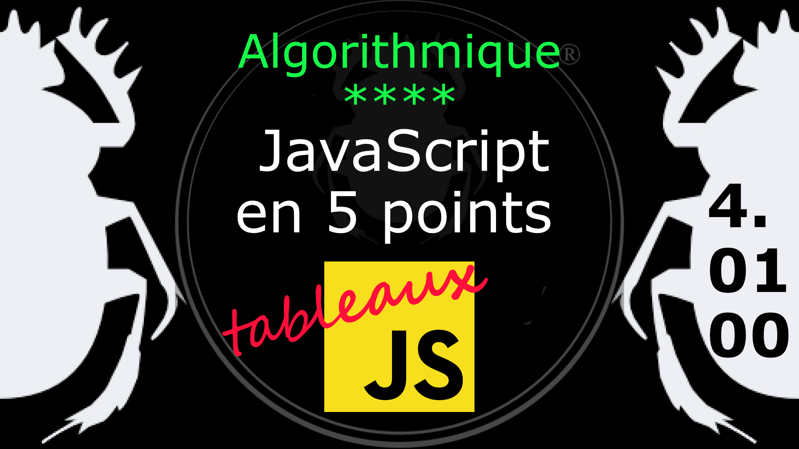

Fiche Web Design

JavaScript en 5 points
1.  Variables
2.  Conditions
3.  Boucles
4.  Tableaux
5.  Fonctions

Technologies en jeux : JavaScript

Vous avez juste besoin d’une navigateur et de sa console web.

# JavaScript en cinq points
## 4. Tableaux

Les tableaux (**Array**) sont des variables complexes qui nous permettent de stocker plus d'une valeur ou un groupe de valeurs sous un seul nom de variable. Les tableaux JavaScript peuvent stocker n'importe quelle valeur valide, y compris des chaînes, des nombres, des objets, des fonctions et même d'autres tableaux, ce qui permet de créer des structures de données plus complexes telles qu'un tableau d'objets ou un tableau de tableaux. 

### 4.01.00 Introduction au tableau (array)

Supponsons que nous ayons plusieurs valeurs, telle que des noms de couleur, à stocker dans notre programme, nous les plaçons dans des variables comme suit :

Exemple

    var color1 = "Rouge";
    var color2 = "Vert";
    var color3 = "Bleu";

Mais que faire quand on en a des centaines ? Comment regrouper des données similaires ou de même source ?

#
Référence

MDN : Référence JavaScript > [Les objets élémentaires JavaScriopt](https://developer.mozilla.org/fr/docs/conflicting/Web/JavaScript/Guide)

MDN : Référence JavaScript > [Array](https://developer.mozilla.org/fr/docs/Web/JavaScript/Reference/Global_Objects/Array)