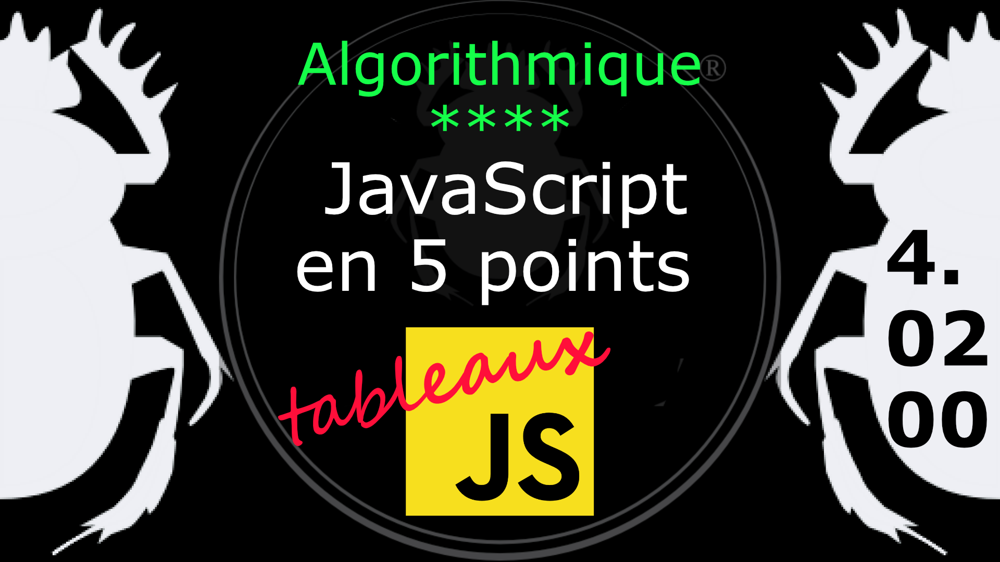
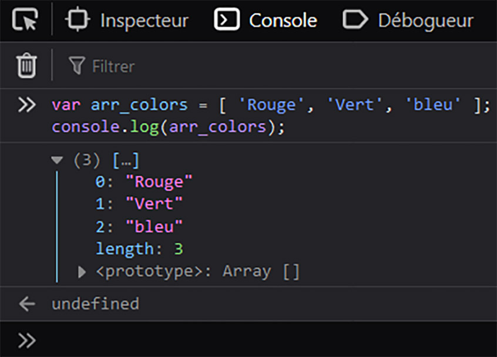
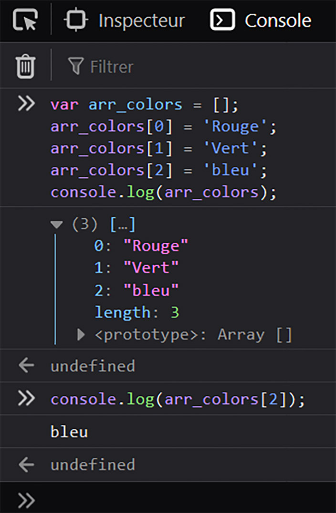

Fiche Web Design

JavaScript en 5 points
1.  Variables
2.  Conditions
3.  Boucles
4.  Tableaux
5.  Fonctions

Technologies en jeux : JavaScript

Vous avez juste besoin d’une navigateur et de sa console web.

# JavaScript en cinq points

## 4. Tableaux

### 4.02.00 Création d'un tableau (Array)

Il y a plusieurs méthodes pour déclarer un tableau en JavaScript, mais suivons notre idée et reprenons les trois couleurs RVB. Il y a un vieil usage qui veut qu'on nomme un tableau en commençant par **ar** ou **arr**, mais c'est vous qui voyez selon vos règles de nommage ou votre goût.

    var arr_colors = new Array( 'Rouge', 'Vert', 'bleu' );  // notez la majuscule à Array()
    var arr_colors = Array( 'Rouge', 'Vert', 'bleu' ); 

    var arr_colors = [ 'Rouge', 'Vert', 'bleu' ];                 // notez les crochets [ ]

Voici trois façons de déclarer un tableau JavaScript. Soit vous utilisez l'objet Array(), soit vous placez directement les valeurs entre crochet (square brackets [ ] ).

Ouvrons la console de notre navigateur et tapons ce qui suit :

    var arr_colors = [ 'Rouge', 'Vert', 'bleu' ];
    console.log( arr_colors );

    // uniquement pour les Web Designer :-D
    console.table( arr_colors );

Si on affiche le tableau via la console du navigateur, celle-ci nous donnes à voir la structure d'un Array() avec ses index. Le premier élément correspond à l'index 0 du tableau, le suivant à 1 et ainsi de suite. On peut même voir la propriété length (taille) qui nous donne la taille du tableau, comme on le verra plus loin. Cela signifie que l'on pourrait tout aussi bien déclarer notre tableau comme ceci :

    var arr_colors = [];
    arr_colors[0] = 'Rouge';
    arr_colors[1] = 'Vert';
    arr_colors[2] = 'bleu';

On déclare un tableau vide, puis on lui ajoute des valeurs pour chaque index. Essayez dans la console.

Si vous souhaitez afficher la couleur bleue vous l'appellerez via son index.

    console.log( arr_colors[2] );

Vous savez comment accéder à la valeur d'un index de tableau.
Essayez ce qui suit pour obtenir la taille du tableau : 

    console.log( arr_colors.length );

#
Référence

MDN : Référence JavaScript > [Les objets élémentaires JavaScriopt](https://developer.mozilla.org/fr/docs/conflicting/Web/JavaScript/Guide)

MDN : Référence JavaScript > [Array](https://developer.mozilla.org/fr/docs/Web/JavaScript/Reference/Global_Objects/Array)