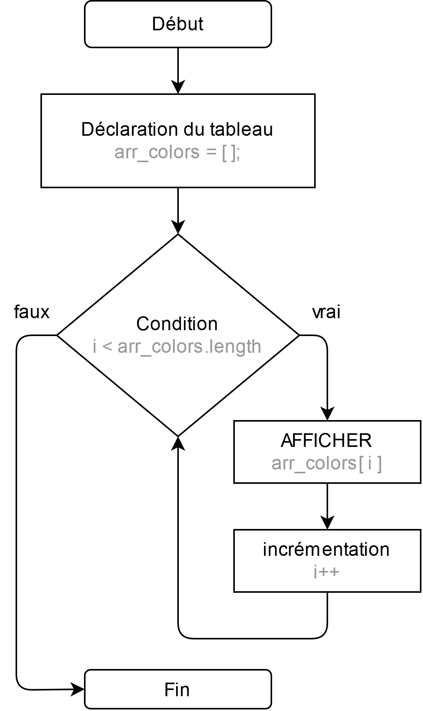

Fiche Web Design

JavaScript en 5 points
1.  Variables
2.  Conditions
3.  Boucles
4.  Tableaux
5.  Fonctions

Technologies en jeux : JavaScript

Vous avez juste besoin d’une navigateur et de sa console web.

# JavaScript en cinq points

## 4. Tableaux

### 4.03.00 Manipulation d'un tableau (Array)

Les tableaux sont des objets qui servent de liste et possèdent plusieurs méthodes incorporées pour exécuter des opérations de parcours et de modification.

Ni la taille d'un tableau ni le types de ses éléments n'est fixé. Puisque la dimension d'un tableau peut augmenter ou diminuer à tout moment, et que les éléments du tableau peuvent être stockés à des emplacements non contigus, les tableaux ne sont pas garantis d'être compacts.

#### Afficher / Accéder

On peut accéder à l'élément d'un tableau en utilisant son index.

    var arr_colors = [ 'Rouge', 'Vert', 'bleu' ];
    console.log( arr_colors[0] );
    // pour afficher la valeur 'rouge'.
                
    console.log( arr_colors.length );
    // pour avoir la taille du tableau	

#### Boucler

On utilise couramment des boucles pour afficher le contenu d'un tableau.

    var arr_colors = [ 'Rouge', 'Vert', 'bleu' ];

    for(var i=0; i<arr_colors.length; i++)
    {
        console.log( arr_colors[i] );
    }             

Si vous avez du mal avec les boucles revoyez la chapitre sur les boucles pour compter de 1 à 10.

#
Référence

MDN : Référence JavaScript > [Les objets élémentaires JavaScriopt](https://developer.mozilla.org/fr/docs/conflicting/Web/JavaScript/Guide)

MDN : Référence JavaScript > [Array](https://developer.mozilla.org/fr/docs/Web/JavaScript/Reference/Global_Objects/Array)