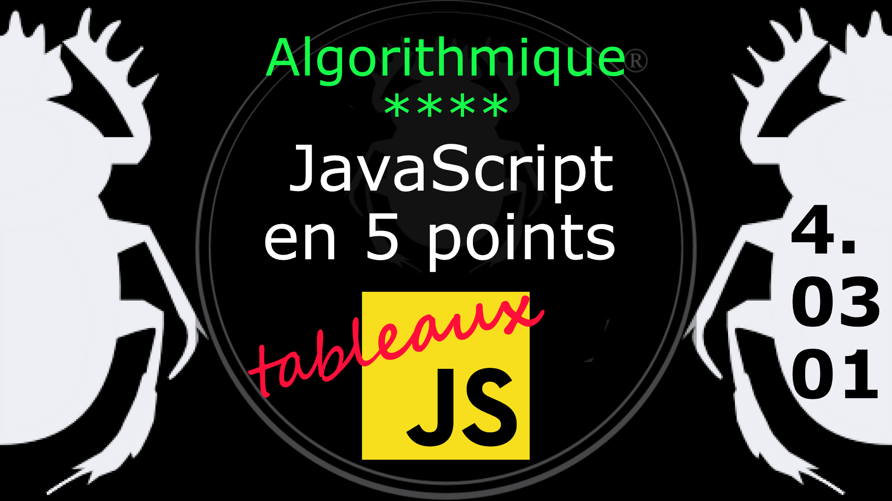
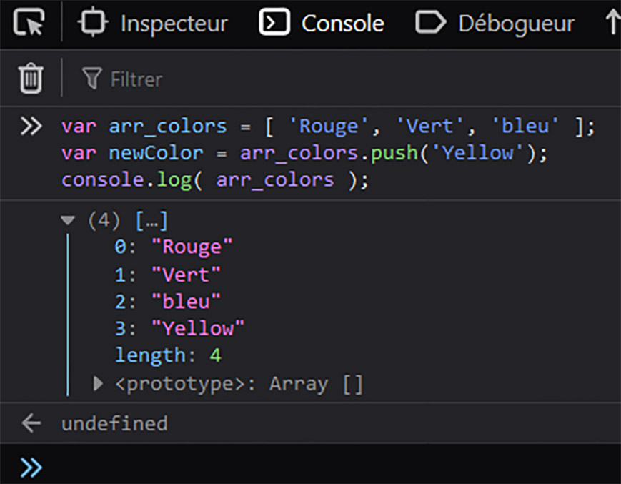
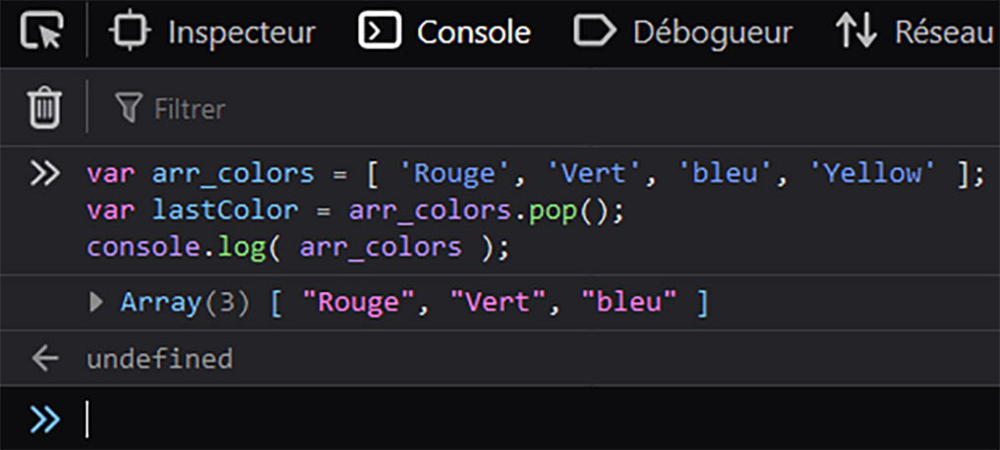

Fiche Web Design

JavaScript en 5 points
1.  Variables
2.  Conditions
3.  Boucles
4.  Tableaux
5.  Fonctions

Technologies en jeux : JavaScript

Vous avez juste besoin d’une navigateur et de sa console web.

# JavaScript en cinq points

## 4. Tableaux

### 4.03.01 Ajouter / Supprimer un élément à la fin du tableau (Push / Pop)

Pour manipuler les éléments du tableau on peut utiliser des méthodes de Array().

#### Ajouter un élément à la fin du tableau (push)

Avec la méthode push() on ajoute un élément à la fin du tableau.

    var arr_colors = [ 'Rouge', 'Vert', 'bleu' ];
    var newColor = arr_colors.push('Yellow');
    console.log( arr_colors );		

#### Supprimer le dernier élément (pop)

Pour le supprimer on utilise la méthode pop().

    var arr_colors = [ 'Rouge', 'Vert', 'bleu', 'Yellow' ];
    var lastColor = arr_colors.pop();
    console.log( arr_colors );	

Donc on voit bien ici que par défaut on ajoute et on supprime le dernier élément.

#
Référence

MDN : Référence JavaScript > [Les objets élémentaires JavaScriopt](https://developer.mozilla.org/fr/docs/conflicting/Web/JavaScript/Guide)

MDN : Référence JavaScript > [Array](https://developer.mozilla.org/fr/docs/Web/JavaScript/Reference/Global_Objects/Array)