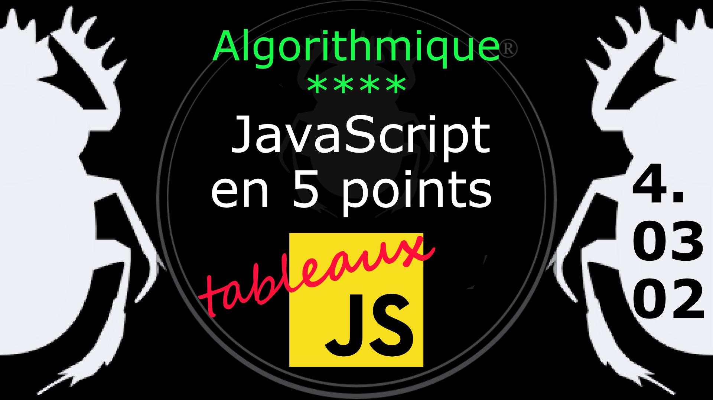
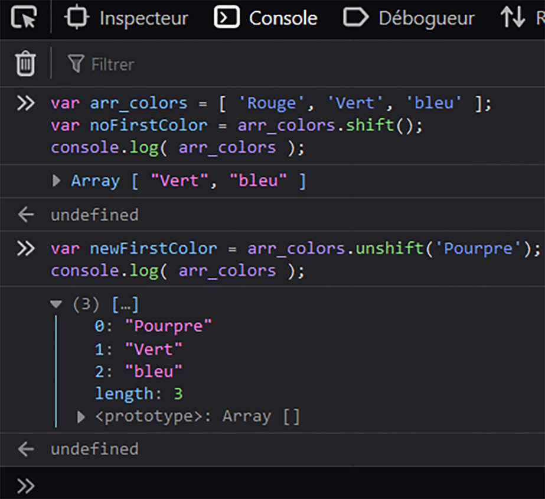
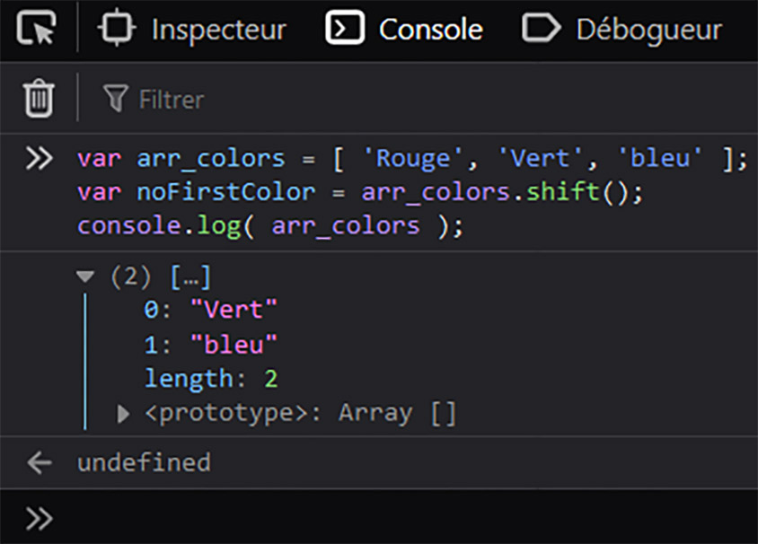

Fiche Web Design

JavaScript en 5 points
1.  Variables
2.  Conditions
3.  Boucles
4.  Tableaux
5.  Fonctions

Technologies en jeux : JavaScript

Vous avez juste besoin d’une navigateur et de sa console web.

# JavaScript en cinq points

## 4. Tableaux

### 4.03.02 Ajouter / Supprimer un élément au début du tableau (Unshift / Shift)

#### Ajouter un élément au début du tableau (unshift)

Ajoutons un élément en première position du tableau.

    var arr_colors = [ 'Rouge', 'Vert', 'bleu' ];
    var newFirstColor = arr_colors.unshift('Pourpre');
    console.log( arr_colors );		

Avec **unshift()** on replace une valeur en pôle position, ici le Pourpre. On notera comment l'index se redécale à nouveau pour réattribuer l'index 0 à la première valeur, puis le 1 à la deuxième valeur et ainsi de suite. 

#### Supprimer un élément au début du tableau (shift)

Supprimons le premier élément du tableau avec **shift()**

    var arr_colors = [ 'Rouge', 'Vert', 'bleu' ];
    var noFirstColor = arr_colors.shift();
    console.log( arr_colors );		

La valeur "Rouge" a bien disparu comme première valeur du tableau. Notez que les index ont changés, la valeur "vert" n'a plus l'index 1 mais est placé en première position avec l'index 0, idem pour le bleu passant de 2 à 1.

#
Référence

MDN : Référence JavaScript > [Les objets élémentaires JavaScriopt](https://developer.mozilla.org/fr/docs/conflicting/Web/JavaScript/Guide)

MDN : Référence JavaScript > [Array](https://developer.mozilla.org/fr/docs/Web/JavaScript/Reference/Global_Objects/Array)