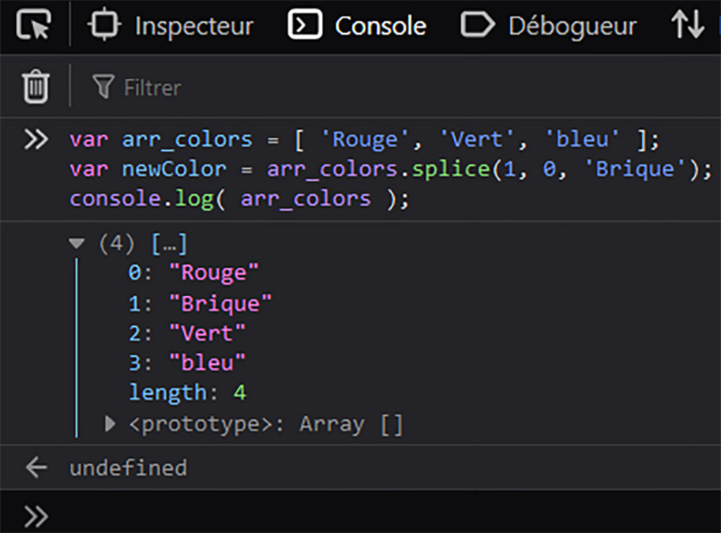
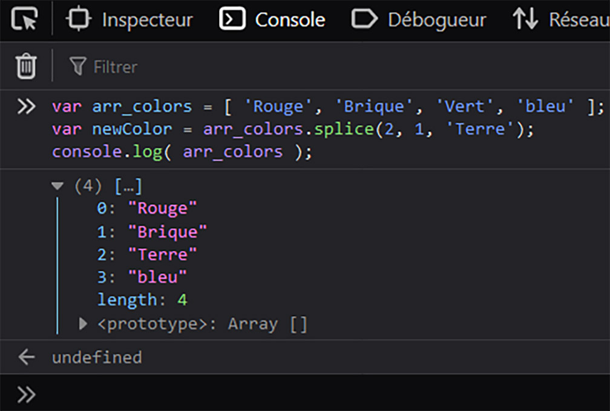
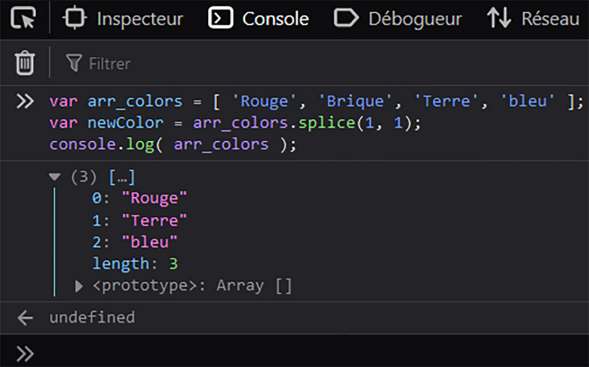

Fiche Web Design

JavaScript en 5 points
1.  Variables
2.  Conditions
3.  Boucles
4.  Tableaux
5.  Fonctions

Technologies en jeux : JavaScript

Vous avez juste besoin d’une navigateur et de sa console web.

# JavaScript en cinq points

## 4. Tableaux

### 4.03.03 Ajouter / Remplacer / Supprimer un élément n'importe où dans le tableau (Splice)
#
#### Comment Ajouter un élément n'importe où dans le tableau ?

    var arr_colors = [ 'Rouge', 'Vert', 'bleu' ];
    var newColor = arr_colors.splice(1, 0, 'Brique');
    console.log( arr_colors );	

Avec splice() on peut ajouter une valeur n'importe où dans le tableau. Il faut se rappeller de l'ordre des arguments :

splice( début, nombre à supprimer, élément );

- Nous le faisons débuter à 1, mais si on avait voulu l'ajouter après "Vert" on l'aurait fait démarrer à 2.
- Pour le deuxième argument on met 0 car on ne supprime rien on souhaite ajouter.
- Enfin la valeur que l'on souhaite ajouter dans le tableau "Brique".

#
#### Remplacer une valeur par une autre (splice) 

Remplacer une valeur par une autre.

    var arr_colors = [ 'Rouge', 'Brique', 'Vert', 'bleu' ];
    var newColor = arr_colors.splice(2, 1, 'Terre');
    console.log( arr_colors );		

Avec *splice()* on peut remplacer une valeur par une autre n'importe où dans le tableau. Rappellons-nous des arguments :

splice( début, nombre à supprimer, élément );

- Nous le faisons débuter à 2 car c'est l'index de la valeur "Vert" que nous souhaitons remplacer.
- L'argument suivant est 1 car nous allons supprimer cette valeur.
- La nouvelle valeur "Terre" qui va prendre la place de l'ancienne "Verte".

#
#### Supprimer une valeur n'importe où dans le tableau (splice)

Supprimer une valeur n'importe où dans le tableau.

    var arr_colors = [ 'Rouge', 'Brique', 'Terre', 'bleu' ];
    var newColor = arr_colors.splice(1, 1);
    console.log( arr_colors );		

Avec *splice()* on peut supprimer une valeur n'importe où dans le tableau. Il faut se rappeller de l'ordre des arguments :

splice( début, nombre à supprimer, élément );

- Nous le faisons débuter à 1 parce que c'est l'index de la valeur "Brique" que l'on souhaite supprimer.
- Puis vient 1, le second argument, pour bien signifié qu'il y a un élément à supprimer.
- Pas d'autre argument dans ce cas.

Voila pour les méthodes les plus courantes (push, pop, shift, unshift, splice). Nous verrons plus bas d'autres méthodes très utiles.

#
Référence

MDN : Référence JavaScript > [Les objets élémentaires JavaScriopt](https://developer.mozilla.org/fr/docs/conflicting/Web/JavaScript/Guide)

MDN : Référence JavaScript > [Array](https://developer.mozilla.org/fr/docs/Web/JavaScript/Reference/Global_Objects/Array)

MDN : Référence JavaScript > [Array.prototype.splice()](https://developer.mozilla.org/fr/docs/Web/JavaScript/Reference/Global_Objects/Array/splice)