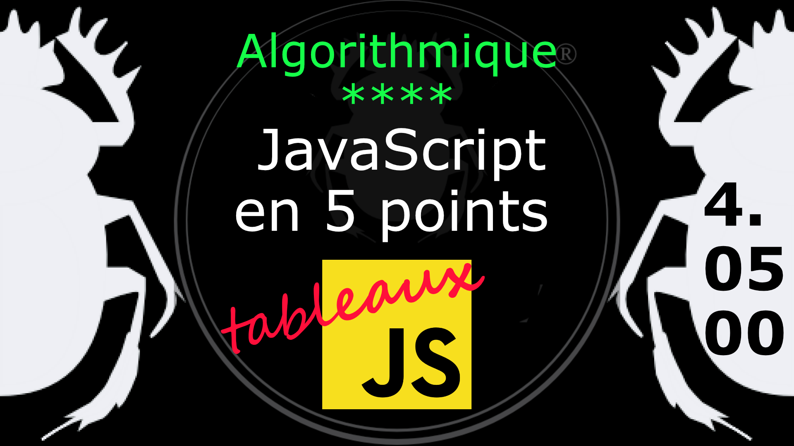

Fiche Web Design

JavaScript en 5 points
1.  Variables
2.  Conditions
3.  Boucles
4.  Tableaux
5.  Fonctions

Technologies en jeux : JavaScript

Vous avez juste besoin d’une navigateur et de sa console web.

# JavaScript en cinq points

## 4. Tableaux

### 4.04.00 Méthodes de tableau 

Le tableau suivant répertorie les méthodes standard de l'objet Array.

 <table cellspacing="0" cellpadding="2" border="1">
					<tbody>
						<tr>
							<th>Méthode</th>
							<th>Description</th>
						</tr>
						<tr>
							<td><code>concat()</code></td>
							<td>Fusionne deux ou plusieurs tableaux et renvoie un nouveau tableau.</td>
						</tr>
						<tr>
							<td><code>copyWithin()</code></td>
							<td>Copie une partie d'un tableau à un autre emplacement du même tableau et le renvoie.</td>
						</tr>
						<tr>
							<td><code>entries()</code></td>
							<td>Renvoie une paire clé / valeur d'un objet d'itération de tableau.</td>
						</tr>
						<tr>
							<td><code>every()</code></td>
							<td>Vérifie si chaque élément d'un tableau passe un test dans une fonction de test.</td>
						</tr>
						<tr>
							<td><code>fill()</code></td>
							<td>Remplissez les éléments d'un tableau avec une valeur statique.</td>
						</tr>
						<tr>
							<td><code>filter()</code></td>
							<td>Crée un nouveau tableau avec tous les éléments qui réussissent le test dans une fonction de test.</td>
						</tr>
						<tr>
							<td><code>find()</code></td>
							<td>Renvoie la valeur du premier élément d'un tableau qui réussit le test dans une fonction de test.</td>
						</tr>
						<tr>
							<td><code>findIndex()</code></td>
							<td>Renvoie la valeur du premier élément d'un tableau qui réussit le test dans une fonction de test.</td>
						</tr>
						<tr>
							<td><code>forEach()</code></td>
							<td>Appelle une fonction une fois pour chaque élément du tableau.</td>
						</tr>						
						<tr>
							<td><code>from()</code></td>
							<td>Crée un tableau à partir d'un objet.</td>
						</tr>
						<tr>
							<td><code>includes()</code></td>
							<td>Détermine si un tableau comprend un certain élément.</td>
						</tr>
						<tr>
							<td><code>indexOf()</code></td>
							<td>Recherchez dans le tableau un élément et renvoie son premier index.</td>
						</tr>
						<tr>
							<td><code>isArray()</code></td>
							<td>Détermine si la valeur transmise est un tableau.</td>
						</tr>
						<tr>
							<td><code>join()</code></td>
							<td>Joint tous les éléments d'un tableau dans une chaîne.</td>
						</tr>
						<tr>
							<td><code>keys()</code></td>
							<td>Renvoie un objet d'itération de tableau, contenant les clés du tableau d'origine.</td>
						</tr>
						<tr>
							<td><code>lastIndexOf()</code></td>
							<td>Recherchez dans le tableau un élément, en commençant par la fin, et retournez son dernier index.</td>
						</tr>
						<tr>
							<td><code>map()</code></td>
							<td>Crée un nouveau tableau avec les résultats de l'appel d'une fonction pour chaque élément du tableau.</td>
						</tr>
						<tr>
							<td><code>pop()</code></td>
							<td>Supprime le dernier élément d'un tableau et renvoie cet élément.</td>
						</tr>
						<tr>
							<td><code>push()</code></td>
							<td>Ajoute un ou plusieurs éléments à la fin d'un tableau et renvoie la nouvelle longueur du tableau.</td>
						</tr>
						<tr>
							<td><code>reduce()</code></td>
							<td>Réduisez les valeurs d'un tableau à une seule valeur (de gauche à droite).</td>
						</tr>
						<tr>
							<td><code>reduceRight()</code></td>
							<td>Réduisez les valeurs d'un tableau à une seule valeur (de  droite à gauche).</td>
						</tr>
						<tr>
							<td><code>reverse()</code></td>
							<td>Inverse l'ordre des éléments dans un tableau.</td>
						</tr>
						<tr>
							<td><code>shift()</code></td>
							<td>Supprime le premier élément d'un tableau et renvoie cet élément.</td>
						</tr>
						<tr>
							<td><code>slice()</code></td>
							<td>Sélectionne une partie d'un tableau et renvoie le nouveau tableau.</td>
						</tr>
						<tr>
							<td><code>some()</code></td>
							<td>Vérifie si l'un des éléments d'un tableau réussit le test dans une fonction de test.</td>
						</tr>
						<tr>
							<td><code>sort()</code></td>
							<td>Trie les éléments d'un tableau.</td>
						</tr>
						<tr>
							<td><code>splice()</code></td>
							<td>Ajoute / supprime des éléments d'un tableau.</td>
						</tr>
						<tr>
							<td><code>toString()</code></td>
							<td>Convertit un tableau en chaîne et renvoie le résultat.</td>
						</tr>
						<tr>
							<td><code>unshift()</code></td>
							<td>Ajoute de nouveaux éléments au début d'un tableau et renvoie la nouvelle longueur du tableau.</td>
						</tr>
						<tr>
							<td><code>values()</code></td>
							<td>Renvoie un objet d'itération de tableau, contenant les valeurs du tableau d'origine.</td>
						</tr>
					</tbody>
			</table>

Exemple d'utilisation des méthodes :

    // Nous avons deux tableaux
    var pets = ["Cat", "Dog", "Parrot"];  
    var wilds = ["Tiger", "Wolf", "Zebra"];
***
    // Mélangeons (concaténons) ces deux tableaux en un seul
    var animals = pets.concat(wilds);
    console.log( animals );    
***
    // Recherchons l'index de la valeur "Wolf"
    console.log( animals.indexOf( 'Wolf' ) );
    // 4
***
    // Vérifions si ce tableau est bien un tableau !
    var test = Array.isArray(animals);
    console.log( test );
    // true
***
    // Affichons le tableau
    animals.forEach( element => console.log( element ) );
    // pour chaque paire clé => valeur, on affiche dans la console	  

#
Référence

MDN : Référence JavaScript > [Les objets élémentaires JavaScriopt](https://developer.mozilla.org/fr/docs/conflicting/Web/JavaScript/Guide)

MDN : Référence JavaScript > [Array](https://developer.mozilla.org/fr/docs/Web/JavaScript/Reference/Global_Objects/Array)
