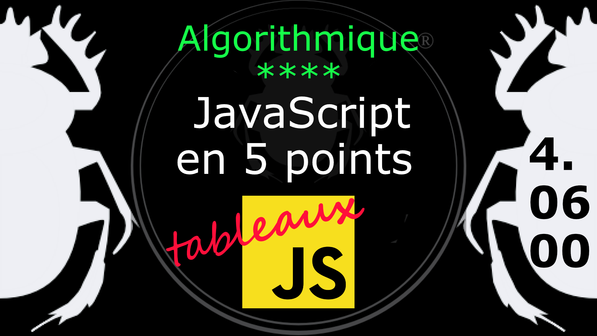
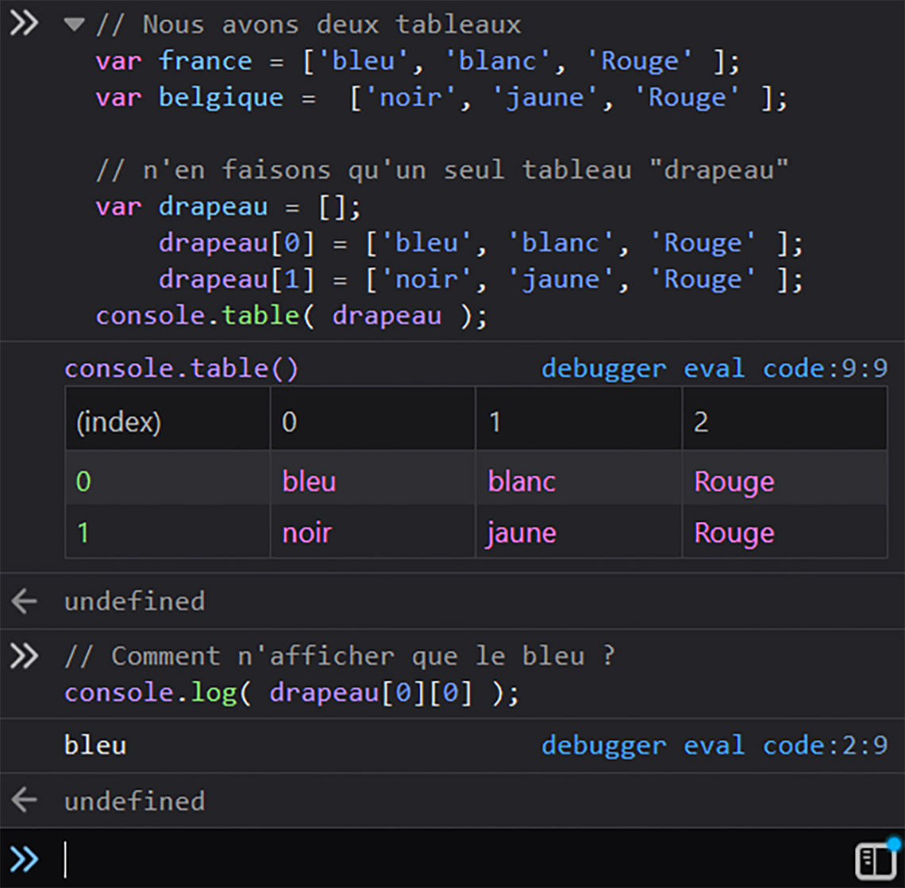

Fiche Web Design

JavaScript en 5 points
1.  Variables
2.  Conditions
3.  Boucles
4.  Tableaux
5.  Fonctions

Technologies en jeux : JavaScript

Vous avez juste besoin d’une navigateur et de sa console web.

# JavaScript en cinq points

## 4. Tableaux

Il y a quelques questions récurrentes chez les pratiquants de JavaScript.

### 4.06.00 Tableaux multidimentionnels 

Peut-on mettre un tableau dans un tableau ? Essayons !

    // Nous avons deux tableaux
    var france = ['bleu', 'blanc', 'Rouge' ]; 
    var belgique =  ['noir', 'jaune', 'Rouge' ]; 

    // n'en faisons qu'un seul tableau "drapeau"
    var drapeau = [];
        drapeau[0] = ['bleu', 'blanc', 'Rouge' ]; 
        drapeau[1] = ['noir', 'jaune', 'Rouge' ]; 
    console.table( drapeau );

    // Comment n'afficher que le bleu ?
    console.log( drapeau[0][0] );

    // Affichez moi la couleur jaune pour voir ;-)

Pour les tableaux multidimensionnels, il suffit de doubler le nombre des index. Le premier index correspondant à celui du tableau "drapeau", le second au tableau stocker dans cet index qui possède son propre index pour chacune de ses valeurs. 

#

#### Tableaux associatifs

Il n'y a pas de tableau associatif en JavaScript comme on peut en trouver en PHP par exemple (voir sur le site de [Pierre Giraud](https://www.pierre-giraud.com/php-mysql-apprendre-coder-cours/tableau-associatif/)). Cependant si vous avez besoin d'utiliser des chaînes de carractères à la place d'index numérique vous pouvez utiliser les objets. Nous les verrons plus tard. 

    // Les objets en JavaScript
    var entity = {                     // notez les accolades
        species: "chat",           // notez les deux points
        name: "Socrate", 
        type: "mortel"
    };
    console.log( "Tous les " + entity.species + "s sont " + entity.type + "s." );
    console.log( "Or "+ entity.name + " est " + entity.type +"." );
    console.log( "Donc " + entity.name + " est un " + entity.species + "." );
    // Le syllogisme d'Eugène Ionesco dans la pièce Rhinocéros, Éditions Gallimard, 1959, p. 47.

#
Référence

MDN : Référence JavaScript > [Les objets élémentaires JavaScriopt](https://developer.mozilla.org/fr/docs/conflicting/Web/JavaScript/Guide)

MDN : Référence JavaScript > [Array](https://developer.mozilla.org/fr/docs/Web/JavaScript/Reference/Global_Objects/Array)
