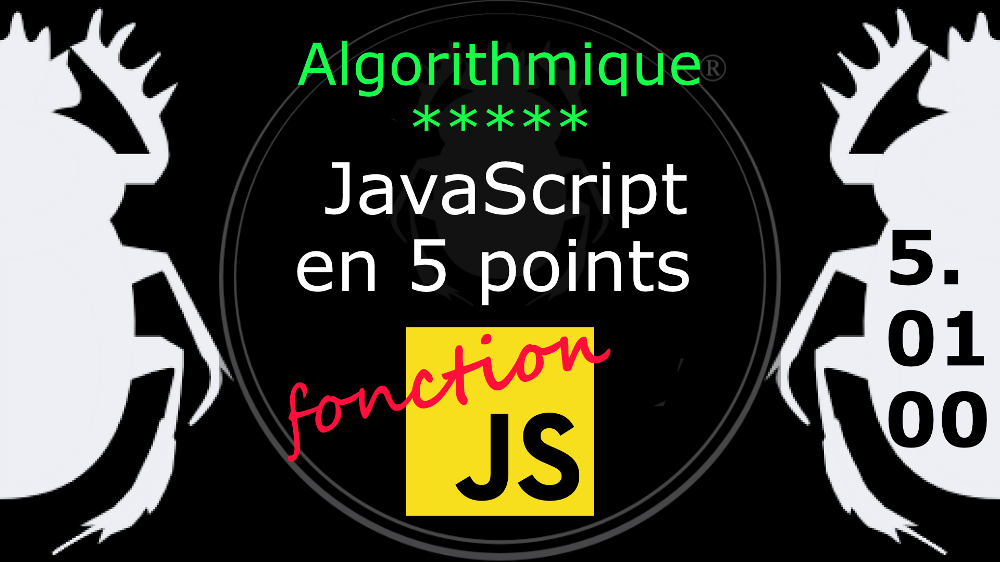

Fiche Web Design

JavaScript en 5 points
1.  Variables
2.  Conditions
3.  Boucles
4.  Tableaux
5.  Fonctions

Technologies en jeux : JavaScript

Vous avez juste besoin d’une navigateur et de sa console web.

# JavaScript en cinq points

## 5. Fonction

### 5.01.00 Introduction

Un programme doit souvent exécuter la même tâche en différents endroits, pour éviter de répéter les instructions nécessaires, et donc pour éviter les erreurs que cela pourrait entraîner, il est préférable de réunir ces instructions au même endroit et d'y faire appel quand cela est nécessaire. Ces unités de code que le programme appelle à volonté s'appelle des fonctions.

Pour afficher une chaîne de caractère il suffit d'appeler une fonction native de JavaScript print sans refaire le bloc de code qui le constitue.

Mais les Fonctions ne sont pas seulement des capsules de code, elles peuvent jouer un rôle de fonction pure (celle des cours de math) dans JavaScript (algorithme, détour, abstraction, décision, module, prolongement, structure de données ...). Le cosinus ou la valeur absolue d'un nombre est une fonction pure à un argument. L'addition est une fonction pure à deux arguments.

#
Référence

MDN : Référence JavaScript > [Fonctions et portée des fonctions](https://developer.mozilla.org/fr/docs/Web/JavaScript/Reference/Functions)

[Quelle différence entre méthode et fonction ?](https://jacques-guizol.developpez.com/javascript/?page=page_5#LV-C)

MDN : Référence JavaScript > [L'objet Function](https://developer.mozilla.org/fr/docs/conflicting/Web/JavaScript/Guide#Lobjet_Function)

MDN : Référence JavaScript > [function](https://developer.mozilla.org/fr/docs/Web/JavaScript/Reference/Statements/function)

MDN : Référence JavaScript > [Fonctions](https://developer.mozilla.org/fr/docs/Web/JavaScript/Guide/Functions)