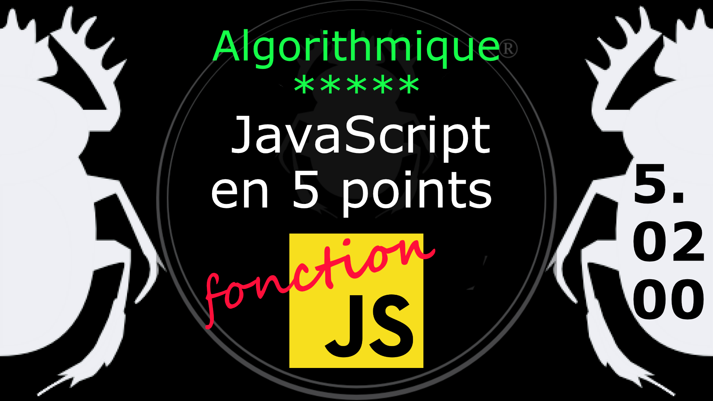

Fiche Web Design

JavaScript en 5 points
1.  Variables
2.  Conditions
3.  Boucles
4.  Tableaux
5.  Fonctions

Technologies en jeux : JavaScript

Vous avez juste besoin d’une navigateur et de sa console web.

# JavaScript en cinq points

## 5. Fonction

### 5.02.00 Instruction et expression

Il y a deux façons de déclarer une fonction, dans un cas elle sera pleinement un objet et pourra être appelé de n'importe quel point du programme. Dans l'autre cas est est appelé expression de fonction et aura une portée plus limité. 
***
#### L'instruction fonction

    function zero() { return 'toto'; }	
    zero();

Ici on a une **instruction fonction** qui a la particularité d'être remontée en haut de la portée (du programme) où elle est déclarée. On peut donc faire appel à une fonction qui sera écrite plus bas dans le code. 

Ici zero est le nom de la fonction.
***
#### L'expression fonction

    var zero = function(){ return 'toto'; };
    zero(); 

Ici il s'agit d'une variable dont la valeur est une fonction. Il faut comprendre que dans JavaScript les **fonctions sont des valeurs** (D. Crockford, *JS les bons éléments*, p. 131). 

Ici zero est le nom de la variable contenant une fonction. 

Sur le principe ce n'est pas la même chose, dans les faits ça fonctionne. Mais cela peut provoquer des problèmes d'imbrication comme on le verra plus loin.

On peut se demander si on peut déclarer une fonction comme suit :

    var zero = function mafonction(){ return 'toto'; };
    zero(); 

Il s'agit d'une **expression de fonction nommée**, ça fonctionne comme une expression de fonction et cela permet plus facilement de retrouver la source de l'erreur qu'avec l'expression fonction.

Disons que lorsqu'on utilise qu'une seule fois une fonction on peut le faire sous la forme d'une expression, alors que pour une utilisation récurrente il est conseillé de la faire avec le mot clé function (instruction de fonction). 

#
Référence

MDN : Référence JavaScript > [Fonctions et portée des fonctions](https://developer.mozilla.org/fr/docs/Web/JavaScript/Reference/Functions)

[Quelle différence entre méthode et fonction ?](https://jacques-guizol.developpez.com/javascript/?page=page_5#LV-C)

MDN : Référence JavaScript > [L'objet Function](https://developer.mozilla.org/fr/docs/conflicting/Web/JavaScript/Guide#Lobjet_Function)

MDN : Référence JavaScript > [function](https://developer.mozilla.org/fr/docs/Web/JavaScript/Reference/Statements/function)

MDN : Référence JavaScript > [Fonctions](https://developer.mozilla.org/fr/docs/Web/JavaScript/Guide/Functions)