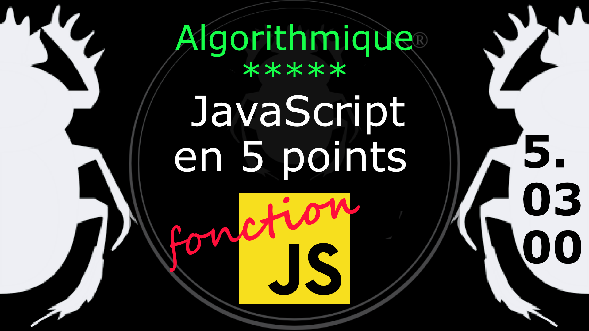

Fiche Web Design

JavaScript en 5 points
1.  Variables
2.  Conditions
3.  Boucles
4.  Tableaux
5.  Fonctions

Technologies en jeux : JavaScript

Vous avez juste besoin d’une navigateur et de sa console web.

# JavaScript en cinq points

## 5. Fonction

### 5.03.00 Fonction sur mesure

Les fonctions sont des objets. Les objets sont des collections de paire nom/valeur ayant un lien avec un objet prototype. On peut les utiliser comme n'importe quel autre valeur. Les fonction peuvent être stockées dans des variables, des objets, des tableaux, elles peuvent être passées comme argument à des fonctions et peuvent même être renvoyé par des fonctions. Et comme les fonctions sont des objets, elles peuvent avoir des méthodes. 

Voyons la syntaxe:

    function nom( paramètre1, paramètre2 ...) {
	    instructions
	}		  
	// nom : le nom de la fonction.
	// parametre1 : les paramètres de la fonction (jusqu'à 255 arguments) sont séparés par une virgule.
	// instructions : les instructions qui constituent le corps de la fonction (etre les accolades).

***
#### Fonction simple
Ma première fonction :

    function mafonction() { 'Peek a boo'; }
    mafonction();			  
    // cette fonction renvoie undefined

La fonction ci-dessus retourne undefined parce qu'elle ne possède pas d'instruction return pour retourner le résultat et donc elle renvoit la valeur par défaut : undefined (indéfini)..

    function mafonction() { return 'Peek a boo'; }
    mafonction();

***
#### Fonction avec paramètres

On peut passer des paramètres à une fonction pour que celle-ci fasse un calcul et nous retourne le résultat. Rappel de la formule pour le calcul de l'aire d'un rectanble : L x l (Largeur x longueur).

	function calculArea( largeur, longueur )
	{
		return largeur * longueur;
	}
	calculArea( 3, 5 );

Comment faire pour placer des valeurs par défaut dans vos paramètres ?

	function toto( a, b ){
		return a + b;
	}
	toto();  //NaN - Not a Number, Pas un nombre

Si on ne place pas de valeur par défaut, JavaScript vous répondra par un NaN (non pas le délicieux petit pain) mais par Not a Number (Pas un nombre) si il s'agit d'un calcul ou bien par un undefined (indéfini) dans le cas ou ce n'est pas un chiffre qui est en paramètre. Pour éviter cela on peut ajouter des valeurs par défaut.

	function toto( a=0, b=0 ){
		return a + b;
	}
	toto();       // 0
    toto(2,3);  // 5

Si c'est une chaîne de caractère qui est comme valeur par défaut de votre argument, n'oubliez pas les guillemets : function toto(a='x', b='y'){}

#
Référence

MDN : Référence JavaScript > [Fonctions et portée des fonctions](https://developer.mozilla.org/fr/docs/Web/JavaScript/Reference/Functions)

[Quelle différence entre méthode et fonction ?](https://jacques-guizol.developpez.com/javascript/?page=page_5#LV-C)

MDN : Référence JavaScript > [L'objet Function](https://developer.mozilla.org/fr/docs/conflicting/Web/JavaScript/Guide#Lobjet_Function)

MDN : Référence JavaScript > [function](https://developer.mozilla.org/fr/docs/Web/JavaScript/Reference/Statements/function)

MDN : Référence JavaScript > [Fonctions](https://developer.mozilla.org/fr/docs/Web/JavaScript/Guide/Functions)