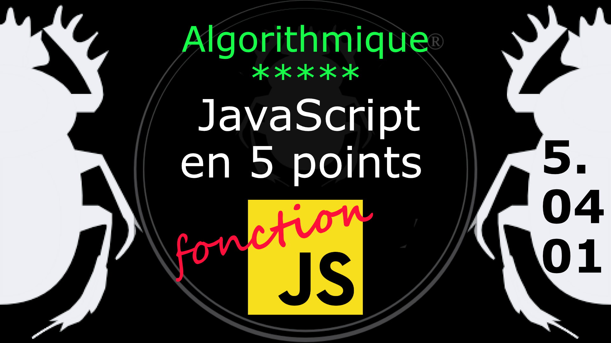

Fiche Web Design

JavaScript en 5 points
1.  Variables
2.  Conditions
3.  Boucles
4.  Tableaux
5.  Fonctions

Technologies en jeux : JavaScript

Vous avez juste besoin d’une navigateur et de sa console web.

# JavaScript en cinq points

## 5. Fonction et portée de fonction

D'une manière générale, une fonction est un sous programme qui peut être appelé par du code extérieur à la fonction (ou interne dans le cas d'une récursion). On peut passer des valeurs à une fonction et elle peut en retourner. 

### 5.04.01 Récursion

La récursivité c'est quand une fonction s'appelle elle même.
On va calculer la puissance d'un nombre (multiplication d'un nombre par lui même).

	function puissance( base, exposant ) {
		if( exposant == 0 ) {
			return 1;
		} else {
			return base * puissance(base, exposant -1);
		}
	}
	puissance( 2,5 );  

Notez le -1 en paramètre dans le rappel de fonction, c'est cela qui permet de décrémenter la valeur de l'argument "exposant" à chaque rappel de fonction, sinon on tombe dans une boucle infinie :-D

Observons le corps de la fonction.

- Le IF teste si la valeur de l'argument exposant est égale à 0, parce que si c'est le cas on ne peut pas calculer la puisance.
-  ELSE est la réponse au test par défaut. On retourne la valeur de l'argument "base" multiplié par la valeur retourné par la fonction puisance. Et oui ici il y a récursion, la fonction s'appelle elle-même tout en décrémentant la valeur de l'argument "exposant" grâce au -1. Sinon c'est la boucle infinie.

        function puissance( base, exposant ) {
            if( exposant == 0 ) {
                return 1;
            } else {
                var exp =  puissance(base, exposant -1);
                var resultat = base * exp;
                console.log(  exposant + ") " + base + " x " + exp + " = " + resultat );
                return resultat;
            }
        }
        puissance( 2,5 ); 
        // 1) 2 * 1 = 2
        // 2) 2 * 2 = 4
        // 3) 2 * 4 = 8
        // 4) 2 * 8 = 16
        // 5) 2 * 16 = 32

On souhaite observer le calcul dans la console.

- On place le rappel de la fonction dans une variable "exp". Le rappel de fonction retourne la valeur du calcul précédent pour le multiplié par la valeur de l'argument "base".
- On place le cacul lui même dans la variable "resultat".
- On affiche dans la console :
    -   la valeur de l'argument "exposant" qui donne le nombre de tour comme un compteur.
    -   suivie de la valeur de l'argument "base", le chiffre de base.
    -   puis le signe de la multiplication avec le résultat du calcul du rappel de fonction.
    -   enfin le résultat du calcul courant, et final.

La récursion c'est pas toujours évidente à intégrer, testez la. 

#
Référence

MDN : Référence JavaScript > [Fonctions et portée des fonctions](https://developer.mozilla.org/fr/docs/Web/JavaScript/Reference/Functions)

[Quelle différence entre méthode et fonction ?](https://jacques-guizol.developpez.com/javascript/?page=page_5#LV-C)

MDN : Référence JavaScript > [L'objet Function](https://developer.mozilla.org/fr/docs/conflicting/Web/JavaScript/Guide#Lobjet_Function)

MDN : Référence JavaScript > [function](https://developer.mozilla.org/fr/docs/Web/JavaScript/Reference/Statements/function)

MDN : Référence JavaScript > [Fonctions](https://developer.mozilla.org/fr/docs/Web/JavaScript/Guide/Functions)