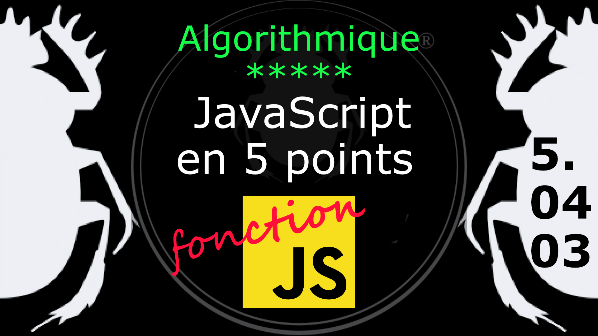

Fiche Web Design

JavaScript en 5 points
1.  Variables
2.  Conditions
3.  Boucles
4.  Tableaux
5.  Fonctions

Technologies en jeux : JavaScript

Vous avez juste besoin d’une navigateur et de sa console web.

# JavaScript en cinq points

## 5. Fonction

### 5.04.03 Conditionnelle

Un autre problème d'imbrication survient avec les instructions conditionnelles (if else).

	// if (0) ou if( false ) est toujours faux
	if (0) {
	   function zero() {
		  console.log("C'est zero.");
	   }
	}
	zero(); 

Ci-dessus la fonction **zero** n'est jamais définie car l'instruction *if(0)* est toujours fausse. Cela signifie que vous ne pouvez pas appeler une fonction non défninie dans une instruction conditionnelle (inbrication d'instruction). La raison en est simple, c'est que même si la déclaration de la fonction zero ressemble à une **instruction fonction** elle est en fait une **expression de l'instruction if**. Donc dans ce cas il est préférable de déclarer une **expression fonction** en rattachant la fonction à une variable, comme ceci :

	if (0) {
	   var zero = function() {
		  console.log("C'est zero.");
	   }
	}
	zero(); 

#
Référence

MDN : Référence JavaScript > [Fonctions et portée des fonctions](https://developer.mozilla.org/fr/docs/Web/JavaScript/Reference/Functions)

[Quelle différence entre méthode et fonction ?](https://jacques-guizol.developpez.com/javascript/?page=page_5#LV-C)

MDN : Référence JavaScript > [L'objet Function](https://developer.mozilla.org/fr/docs/conflicting/Web/JavaScript/Guide#Lobjet_Function)

MDN : Référence JavaScript > [function](https://developer.mozilla.org/fr/docs/Web/JavaScript/Reference/Statements/function)

MDN : Référence JavaScript > [Fonctions](https://developer.mozilla.org/fr/docs/Web/JavaScript/Guide/Functions)