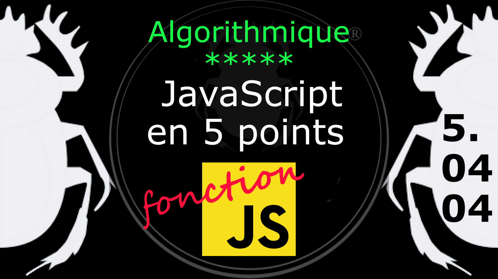

Fiche Web Design

JavaScript en 5 points
1.  Variables
2.  Conditions
3.  Boucles
4.  Tableaux
5.  Fonctions

Technologies en jeux : JavaScript

Vous avez juste besoin d’une navigateur et de sa console web.

# JavaScript en cinq points

## 5. Fonction

### 5.04.04 Gestionnaire d'évènement : onClick

En JavaScript les gestionnaires d'évènements (Event Handlers) sont des fonctions (et non des objets) contenant une méthode handleEvent de liaison avec le DOM. Ces fonctions ont l'objet event comme unique paramètre.

Les objets d'un document HTML suceptible de recevoit des évènements sont

- window (et non windowS),
- document (HTMLdocument)
- Element.

Ces objets possèdent des propriétés gestionnaires d'évènements préfixé par on comme onfocus.

Les évènements font partie de la logique du DOM et non de celle de JavaScript. Ce dernier n'est qu'un moyen de manipuler le DOM. 

***
#### Les attributs HTML de type évènement

Regardons comment on peut faire appel à une fonction avec un gestionnaire d'évènement HTML.

	function changeColor() {
		document.getElementById("simple").style.backgroundColor="tomato";
	}

On crée une petite fonction changeColor dans laquelle :

- On cible : dans le document (document) attrape un élément par son ID (getElementById).
- suivie du nom de l'ID "simple"
- Puis on lui applique la **méthode** style, la **propriété** backgroundColor avec la **valeur** "tomato"

<pre>
    // dans la page html
    < div id="simple" class="simple" onClick="changeColor(this)"> < /div>
</pre>

Dans la page HTML on crée notre cible, une simple DIV possédant l'ID "simple" (les ID sont réservées pour JavaScript et non pour CSS). Puis on lui ajoute un gestionnaire d'évènement onClick (on les reconnaît parce qu'ils commencent par on...). Ce gestionnaire d'évènement possède en valeur le nom de la fonction que l'on souhaite appeller si on clique sur cette DIV, et ce n'est autre que changeColor, notre petite fonction.

Donc en résumé on a un gestionnaire d'évènement dans la DIV que l'on souhaite modifier en appelant une fonction. Cette fonction cible notre DIV pour lui appliquer une modification du DOM (ici la couleur d'arrière plan). Voir l'exemple : [ex001.html](../exemple/ex001.html)

L'inconvénient de cette méthode est de devoir placé le gestionnaire d'évènement dans le HTML et non du côté JavaScript. C'est pour cela que cette méthode n'est plus recommandé aujourd'hui.

#
Référence

MDN : Référence JavaScript > [Fonctions et portée des fonctions](https://developer.mozilla.org/fr/docs/Web/JavaScript/Reference/Functions)

[Quelle différence entre méthode et fonction ?](https://jacques-guizol.developpez.com/javascript/?page=page_5#LV-C)

MDN : Référence JavaScript > [L'objet Function](https://developer.mozilla.org/fr/docs/conflicting/Web/JavaScript/Guide#Lobjet_Function)

MDN : Référence JavaScript > [function](https://developer.mozilla.org/fr/docs/Web/JavaScript/Reference/Statements/function)

MDN : Référence JavaScript > [Fonctions](https://developer.mozilla.org/fr/docs/Web/JavaScript/Guide/Functions)