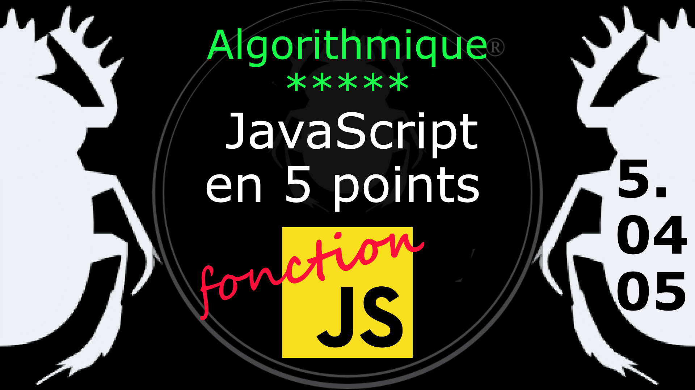

Fiche Web Design

JavaScript en 5 points
1.  Variables
2.  Conditions
3.  Boucles
4.  Tableaux
5.  Fonctions

Technologies en jeux : JavaScript

Vous avez juste besoin d’une navigateur et de sa console web.

# JavaScript en cinq points

## 5. Fonction

### 5.04.05 Gestionnaire d'évènement : les écouteurs d'évènements (Event Listener)

La méthode addEventListener (littéralement : ajoute un écouteur d'évènement) permet une gestion complète des évènements en manipulant le DOM avec JavaScript. On cible des éléments du DOM depuis JavaScript pour leur appliquer des modifications.

    // utilisation d'écouteur d'évènement"
        document.addEventListener("click", function() {
            document.getElementById("simple").innerHTML = "Hello World";
        });

- On place dans la page (document) un écouteur d'évènement (addEventListener)
- Cette méthode prend en paramètre l'évènement à écouter, ici le **click**, ainsi que la fonction à appeller pour prendre à charge cet évènement. Ici la **fonction** est générique (sans nom).
- Dans le corps de la méthode addEventListener on retrouve
    -   le ciblage classique du DOM avec la **méthode** getElementById pour écouter le DIV dont l'id est "simple"
    -   sur lequel on applique la **propriété** innerHTML qui permet d'insérer du texte dans l'élément.
    -   Le texte ajouté correspond à la **valeur** "Hello World!" (clin d'oeil aux inventeurs du C).

Voir l'exemple avec les deux méthodes : [ex002.html](../exemple/ex002.html)

On n'approndira pas plus ici puisqu'il s'agit d'avantage de la manipulation du DOM que de JavaScript. C'était pour situer l'utilisation des fonctions dans la gestion d'évènement HTML. il faudra voir l'atelier sur l'interaction HTML, CSS, JavaScript. 

#
Référence

MDN : Référence JavaScript > [Fonctions et portée des fonctions](https://developer.mozilla.org/fr/docs/Web/JavaScript/Reference/Functions)

[Quelle différence entre méthode et fonction ?](https://jacques-guizol.developpez.com/javascript/?page=page_5#LV-C)

MDN : Référence JavaScript > [L'objet Function](https://developer.mozilla.org/fr/docs/conflicting/Web/JavaScript/Guide#Lobjet_Function)

MDN : Référence JavaScript > [function](https://developer.mozilla.org/fr/docs/Web/JavaScript/Reference/Statements/function)

MDN : Référence JavaScript > [Fonctions](https://developer.mozilla.org/fr/docs/Web/JavaScript/Guide/Functions)

MDN : Référence JavaScript > [Introduction aux évènements](https://developer.mozilla.org/fr/docs/Learn/JavaScript/Building_blocks/Events)

Eloquent JavaScript : [Evènements du navigateur](https://fr.eloquentjavascript.net/chapter13.html)

Pierre Giraud : [La gestion d'évènements en JavaScript et la méthode addEvent Listener](https://www.pierre-giraud.com/javascript-apprendre-coder-cours/addeventlistener-gestion-evenement/)

Douglas Crockford, *Javascript : les bons éléments*, Pearson, 2013, 180 pages, français, ISBN : 2744025828

Douglas Crockford, *Javascript: The Good Parts*, O'Reilly, 2008, 170 pages, english, ISBN : 9780596517748

Eloquent JavaScript : https://fr.eloquentjavascript.net/